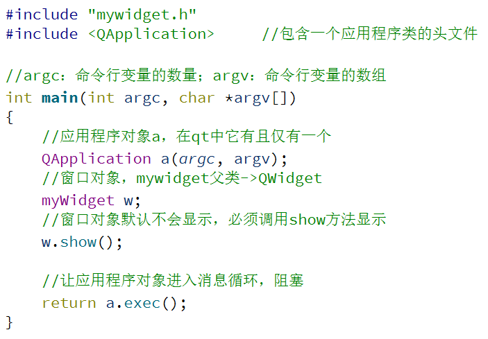
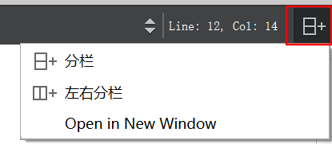
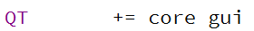
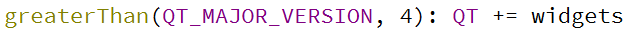
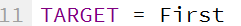
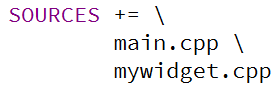
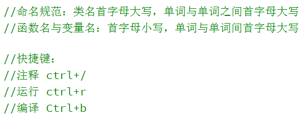
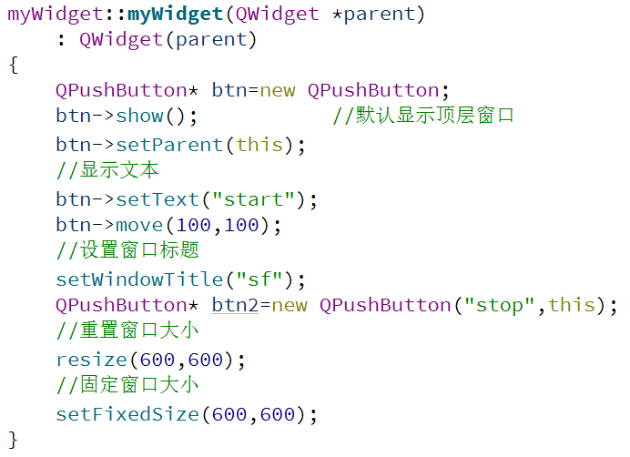
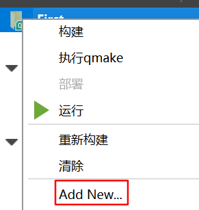
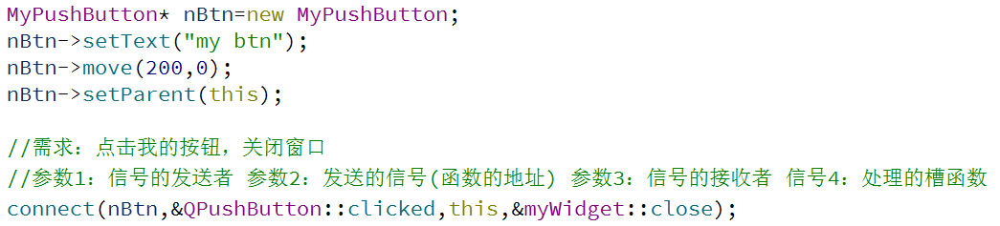

### 创建第一个qt程序

使用widget来创建程序：



右上角可选择是否分栏。



在.pro文章中：

这一行表示该文件中包含的模块：

这一行表示，在大于4版本以上的多加了widgets模块：

这一行表示生成的exe的名称为First：

template行表示是应用程序模板：

源文件：

头文件：

命名规范和快捷键见：



帮助文档 F1

自动对齐 ctrl+i

#### 窗口中加button

参考下面链接：



#### 对象树

Qobject类有一个私有变量QList<QObject *>，专门存储这个类的子孙后代们。当创建一个QObject并指定父对象时，会把自己加入到父对象的children()列表中。

这样的好处在于：当父对象被析构时，子对象也会被析构。

添加新的类：



然后在新的类中加好析构函数，继承自的父类等信息，再在widget.cpp中写。

在设置坐标时，需要记住，Qt的左上角为(0,0)，x向右进行增加，y向下进行增加。

#### 信号和槽

信号和槽用于对象间的**通讯**。它是Qt的核心特征。当改变一个部件时，通常想要其他部件被通知。或者希望任何一类的对象可以和其他对象进行通信。它实际上就是**观察者模式**，当某个事件发生时，它会发出一个信号(signal)，当有对象对这个信号感兴趣时，它会使用connect连接函数，将想要处理的信号和自己的一个函数(称为槽slot)绑定来处理这个信号。

即当信号发出时，被连接的槽会自动被回调。即当发生了感兴趣的事件，某一个操作就会被自动触发。



使用上图的方式，可以点击nBtn就触发关闭窗口。

槽的本质是类的成员函数，其参数可以是任意类型。它可以是虚函数，也可以被重载；可以是公有的、保护的、私有的，区别在于：**槽可以和信号连接在一起**，每当和槽连接的信号被发射时，就会调用这个槽。

#### Qt拆分窗口

拆分窗口使用QSplitter，也可以使用布局控件完成，QSplitter继承自QFrame，QFrame继承自QWidget，因此使用QSplitter拆分窗口：

- 新建一个QSPlitter
- 通过指定父子关系完成嵌套
- QSPlitter可以放到指定的任何窗口内

```Qt
#include "mainwindow.h"
#include <QApplication>
#include <QSplitter>
#include <QTextEdit>
#include <QTextCodec>
int main(int argc, char *argv[])
{
    QApplication a(argc, argv);
    QFont font("ZYSong18030",12);
    a.setFont(font);
    //分割窗口
    QSplitter *splitterMain=new QSplitter(Qt::Horizontal,0);

    QTextEdit *textLeft=new QTextEdit(QObject::tr("Main Widget"),splitterMain);

    QSplitter *splitterRight=new QSplitter(Qt::Vertical,splitterMain);

    QTextEdit *textUp=new QTextEdit(QObject::tr("Top Widget"),splitterRight);
    textUp->setAlignment(Qt::AlignCenter);

    splitterMain->setWindowTitle(QObject::tr("Lam"));
    splitterMain->show();
 //connect(ui->actionquit,&QAction::triggered,[=](){this->close();});
    return a.exec();
}

```

目前的难点：

- 将圆画在左边页面
- 右边页面显示许多按钮(这一点暂时找到)
- 将图片代替图标(不知道为什么不行)


上面这个容器可以有拖拉的框。

```Qt
for(int i = 0; i < 100; i++)
    {
        QPushButton *pBtn = new QPushButton();
        pBtn->setText(QString("按钮%1").arg(i));
        pBtn->setMinimumSize(QSize(60,30));   //width height
        pLayout->addWidget(pBtn);//把按钮添加到布局控件中
    }
    ui->scrollArea->widget()->setLayout(pLayout);//把布局放置到QScrollArea的内部QWidget中
```

addWidget()方法用于加入需要布局的控件，addLayout()方法用于加入布局。