# 股票类题型

股票类主要可以使用**贪心算法**和**动态规划**，在力扣上一共有6个题目：

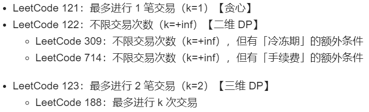

对于动态规划，很重要的就是分析状态和状态下的选择。

### 121-买卖股票的最佳时机

#### 题目描述：

给定一个数组，它的第 i 个元素是一支给定股票第 i 天的价格。

如果你最多只允许完成一笔交易（即买入和卖出一支股票一次），设计一个算法来计算你所能获取的最大利润。

注意：你不能在买入股票前卖出股票。

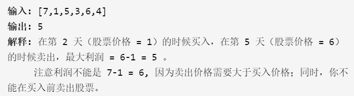

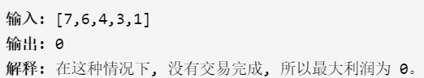

#### 解题思路：

使用动态规划的方法，状态转移方程为`dp[i]=max(dp[i-1],prices[i]-minV)`，其中`minV`指的是在i之前的最小价格值。代码如下：

```c++
class Solution {
public:
    int maxProfit(vector<int>& prices) {
        int len=prices.size();
        if(len==0) return 0;
        int minV=prices[0];
        vector<int> dp(len,0);
        int tmp=0;
        for(int i=1;i<len;++i)
        {
            tmp=prices[i]-minV;
            dp[i]=max(dp[i-1],tmp);
            minV=min(prices[i],minV);
        }
        return dp[len-1];
    }
};
```


### 122-买卖股票的最佳时机II

#### 题目描述：

给定一个数组，它的第 i 个元素是一支给定股票第 i 天的价格。

设计一个算法来计算你所能获取的最大利润。你可以尽可能地完成更多的交易（多次买卖一支股票）。

注意：你不能同时参与多笔交易（你必须在再次购买前出售掉之前的股票）。

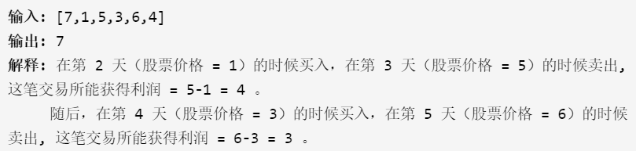

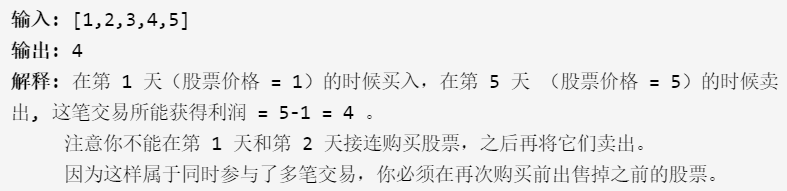

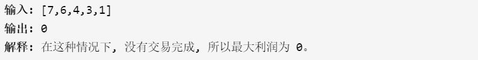

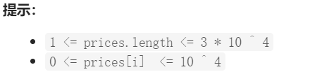


#### 解题思路：

这道题可以使用贪心算法和动态规划来做（能用到贪心算法的地方就能用到动态规划），针对贪心算法，即遇到低价就买入，遇到高价就卖出。

代码如下：

```C++
class Solution {
public:
    int maxProfit(vector<int>& prices) {
        int res=0;
        for(int i=0;i<prices.size()-1;i++)
        {
            if(prices[i]<prices[i+1])
            {
                res+=prices[i+1]-prices[i];
            }
        }
        return res;
    }
};
```

针对动态规划，对于第i天有两种状态：持有或者不持有，用`dp[i][1]`和`dp[i][0]`表示。由于返回最大利润，最后输出的肯定是不持有的，即`dp[len-1][0]`。

若第i天持有，则：

- 第i-1天没有持有，第i天买入：`dp[i][1]=dp[i-1][0]-prices[i]`；

- 第i-1天也持有，第i天没有卖出：`dp[i][1]=dp[i-1][1]`

  取两者中最大值即为第i天持有的利益。

若第i天不持有，则：

- 第i-1天也没有持有：`dp[i][0]=dp[i-1][0]`；

- 第i-1天持有，第i天卖出：`dp[i][0]=dp[i-1][1]+prices[i]`

  取两者中最大值即为第i天不持有的利益。

代码如下：

```c++
class Solution {
public:
    int maxProfit(vector<int>& prices) {
        int len=prices.size();
        vector<vector<int>> dp(len,vector<int>(2));
        dp[0][0]=0;
        dp[0][1]=-prices[0];
        for(int i=1;i<len;i++)
        {
            dp[i][0]=max(dp[i-1][1]+prices[i],dp[i-1][0]);
            dp[i][1]=max(dp[i-1][0]-prices[i],dp[i-1][1]);
        }
        return dp[len-1][0];
    }
};
```


### 309-最佳股票买卖时机含冷冻期

#### 题目描述：

给定一个整数数组，其中第 i 个元素代表了第 i 天的股票价格 。

设计一个算法计算出最大利润。在满足以下约束条件下，你可以尽可能地完成更多的交易（多次买卖一支股票）:

你不能同时参与多笔交易（你必须在再次购买前出售掉之前的股票）。
卖出股票后，你无法在第二天买入股票 (即冷冻期为 1 天)。

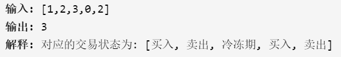

#### 解题思路：

动态规划，若只分为持有和不持有两种情况，则不持有的情况会很多，难以计算。因此分为持有、不持有且不处于冷冻期、不持有且处于冷冻期三种情况，分别设为`dp[i][2]、dp[i][0]、dp[i][1]`。

- 持有分为：一直持有，即`dp[i-1][2]`；i-1天不为冷冻期，因此在第i天买入，即`dp[i-1][0]-prices[i]`。
- 不持有且不处于冷冻期：一直不持有，即`dp[i-1][0]`；第i-1天为冷冻期因此未持有，即`dp[i-1][1]`。
- 不持有且处于冷冻期：说明第i-1天卖掉了股票，即`dp[i-1][2]+prices[i]`。

代码如下：

```c++
class Solution {
public:
    int maxProfit(vector<int>& prices) {
        int len=prices.size();
        if(len==0) return 0;
        vector<vector<int>> dp(len,vector<int>(3,0));
        dp[0][0]=0;
        dp[0][1]=0;
        dp[0][2]=-prices[0];
        for(int i=1;i<len;++i)
        {
            //不持有且不在冷冻期
            dp[i][0]=max(dp[i-1][0],dp[i-1][1]);
            //不持有且在冷冻期
            dp[i][1]=dp[i-1][2]+prices[i];
            //持有
            dp[i][2]=max(dp[i-1][2],dp[i-1][0]-prices[i]);
        }
        return max(dp[len-1][0],dp[len-1][1]);
    }
};
```

[参考链接](https://leetcode-cn.com/problems/best-time-to-buy-and-sell-stock-with-cooldown/solution/zui-jia-mai-mai-gu-piao-shi-ji-han-leng-dong-qi-4/)


### 714-买卖股票的最佳时机含手续费

#### 题目描述：

给定一个整数数组 prices，其中第 i 个元素代表了第 i 天的股票价格 ；非负整数 fee 代表了交易股票的手续费用。

你可以无限次地完成交易，但是你每笔交易都需要付手续费。如果你已经购买了一个股票，在卖出它之前你就不能再继续购买股票了。

返回获得利润的最大值。

注意：这里的一笔交易指买入持有并卖出股票的整个过程，每笔交易你只需要为支付一次手续费。

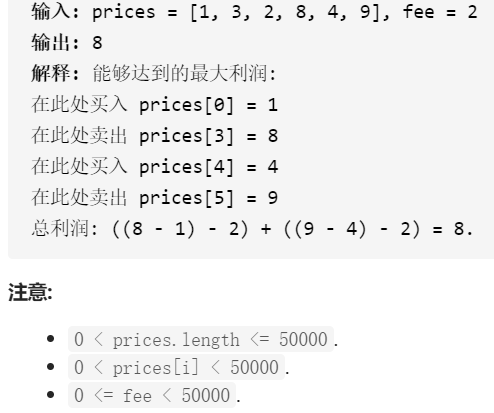

#### 解题思路：

这题相当于在无限次交易的前提下加了每次整个过程都需要手续费，因此只需要在考虑卖出时将利润减去手续费即可。

代码如下：

```c++
class Solution {
public:
    int maxProfit(vector<int>& prices, int fee) {
        int len=prices.size();
        if(len==0) return 0;
        vector<vector<int>> dp(len,vector<int>(2,0));
        dp[0][0]=0;
        dp[0][1]=-prices[0];
        for(int i=1;i<len;++i)
        {
            dp[i][1]=max(dp[i-1][1],dp[i-1][0]-prices[i]);
            dp[i][0]=max(dp[i-1][0],dp[i-1][1]+prices[i]-fee);
        }
        return dp[len-1][0];
    }
};
```


### 123-买卖股票的最佳时机III

#### 题目描述：

给定一个数组，它的第 i 个元素是一支给定的股票在第 i 天的价格。

设计一个算法来计算你所能获取的最大利润。你最多可以完成 两笔 交易。

注意: 你不能同时参与多笔交易（你必须在再次购买前出售掉之前的股票）。

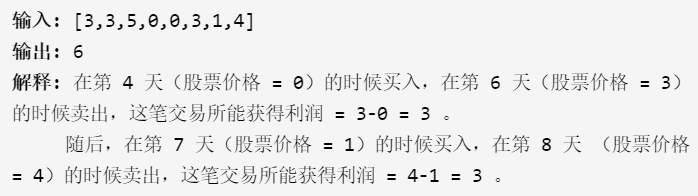

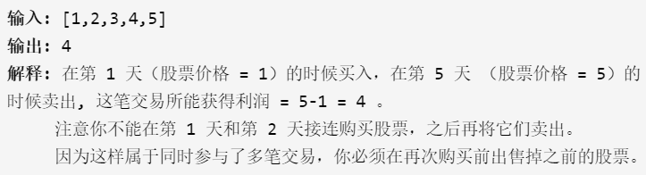

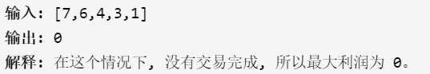

解题思路：

限制了k的次数后，需要将k可能的情况进行枚举，考虑到每种情况，因此相当于是在前面的题型基础上加一层对于k的for循环。代码如下：

```C++
#include<vector>
#include<iostream>
#include<string.h>
#include<algorithm>
using namespace std;

//对k的次数可以进行选择
int maxProfit(vector<int>& prices, int time) {
	int len = prices.size();
	if (len == 0) return 0;
	int max_k = time + 1;
	vector<vector<int>> sun(max_k, vector<int>(2, 0));
	vector<vector<vector<int>>> dp(len, sun);
	for (int i = 0; i < len; ++i)
	{
		for (int k = 1; k < max_k; ++k)
		{
			if (i == 0)
			{
				dp[0][k][0] = 0;
				dp[0][k][1] = -prices[0];
				continue;
			}
			dp[i][k][0] = max(dp[i - 1][k][0], dp[i - 1][k][1] + prices[i]);
			dp[i][k][1] = max(dp[i - 1][k][1], dp[i - 1][k - 1][0] - prices[i]);
		}
	}
	return dp[len - 1][2][0];
}

int main()
{
	vector<int> prices;
	int x;
	int k = 2;
	cout << "enter the array of prices: ";
	for (int i = 0; i < 6; ++i)
	{
		cin >> x;
		prices.push_back(x);
	}
	int res = maxProfit(prices, k);
	cout << endl << "the result is: " << res << endl;
	return 0;
}
```


### 188-买卖股票的最佳时机IV

#### 题目描述：

给定一个数组，它的第 i 个元素是一支给定的股票在第 i 天的价格。

设计一个算法来计算你所能获取的最大利润。你最多可以完成 k 笔交易。

注意: 你不能同时参与多笔交易（你必须在再次购买前出售掉之前的股票）。

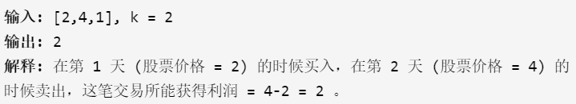

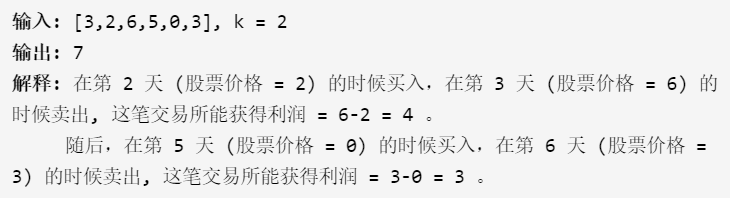

#### 解题思路：

当k较小时，和前述代码一致；当k大于prices数组的大小的一半时，退化为无数次交易的情况。代码如下：

```c++
class Solution {
public:
int greedy(vector<int>& prices)
{
    int maxV=0;
    int len=prices.size();
    for(int i=1;i<len;++i)
    {
        if(prices[i]>prices[i-1])
        {
            maxV+=prices[i]-prices[i-1];
        }
    }
    return maxV;
}

    int maxProfit(int k, vector<int>& prices) {
        int len=prices.size();
        if(len==0) return 0;
        if(k>len/2) return greedy(prices);
        int max_k=k+1;
        vector<vector<int>> sun(max_k, vector<int>(2, 0));
	    vector<vector<vector<int>>> dp(len, sun);
        for(int i=0;i<len;++i)
        {
            for(int t=1;t<max_k;++t)
            {
                if(i==0)
                {
                    dp[0][t][0]=0;
                    dp[0][t][1]=-prices[0];
                    continue;
                }
                dp[i][t][0]=max(dp[i-1][t][0],dp[i-1][t][1]+prices[i]);
                dp[i][t][1]=max(dp[i-1][t][1],dp[i-1][t-1][0]-prices[i]);
            }
        }
        return dp[len-1][k][0];
    }
};
```

