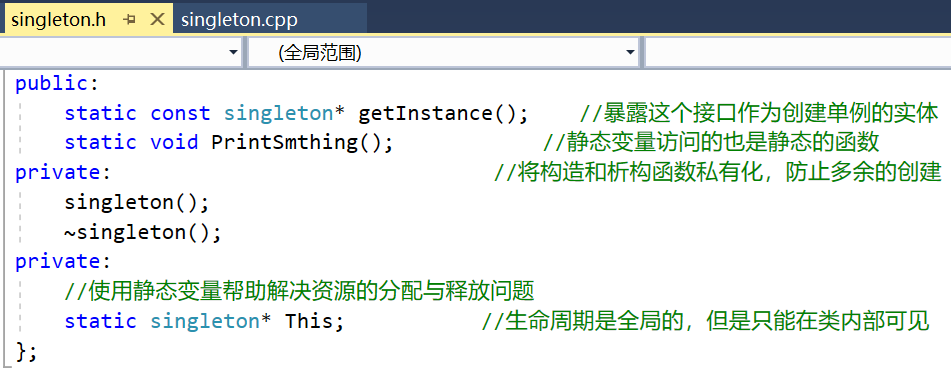
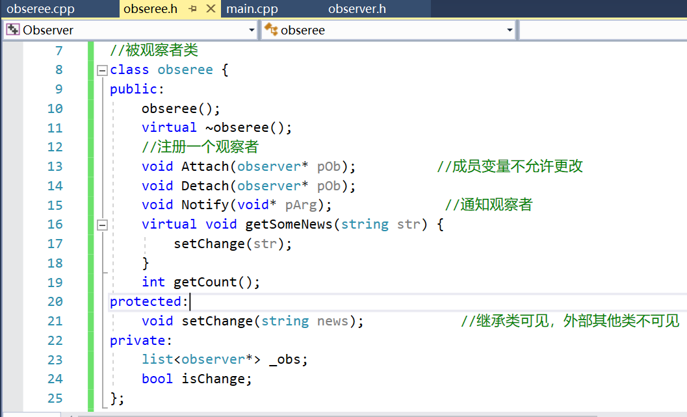
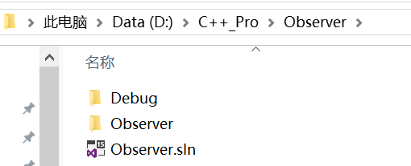
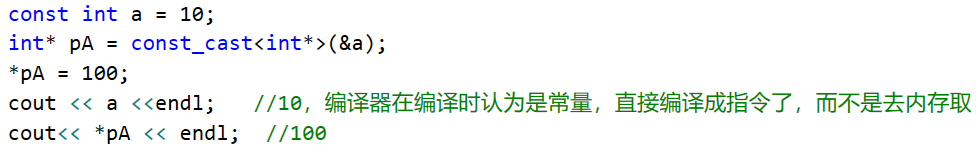
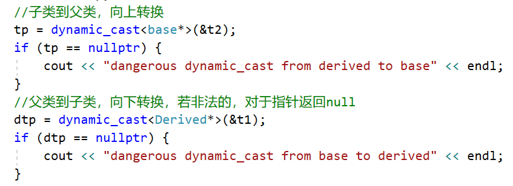
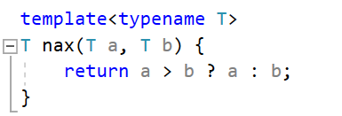
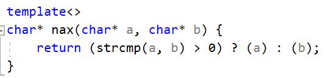
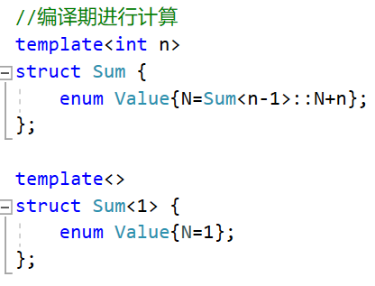
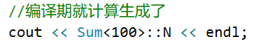

## 软件设计模式和类型转换

#### 1、定义

使用前人的设计经验总结出来的对于一些普遍存在的问题提供的通用的解决方案。面向对象的常见**23**种模式。

#### 2、单例模式

整个程序中只有一个实例。

常见场景如数据库分配主键。

实现：

详见

#### 3、观察者模式

观察者需要订阅目标事件，在目标发出内容改变的事件后，直接接收事件并做出响应。对象通常是一对多的关系。

常用场景：MVC的框架中，model的变化通知各种类型的view时。

实现：

详见

#### 4、void*和nullptr

在C语言中，NULL等价于(void*)0，void\*可以转换为任意类型。而在C++中，NULL即为0，nullptr表示(void\*)0。

#### 5、类型转换

##### 1、const_cast

用于转换指针或引用，去掉类型的const属性。

##### 2、reinterpret_cast

很危险，它不检查指向的内容，也不检查指针类型本身。但要求转换前后的类型所占用内存大小一致。

##### 3、static_cast

基本类型转换，有继承关系类对象和类指针间的转换。程序员需要自己确保转换是安全的。

##### 4、dynamic_cast

只能用于含有虚函数的类，必须要用在多态体系中。用于类层次间的向上和向下转化。

#### 6、适配器

将类接口转换为客户端期望的另一个接口。使用适配器可以防止类由于接口不兼容而一起工作。

多重继承导致了**钻石继承**（一个派生类继承自多个基类，并且这些基类都继承自一个类，同时都定义了自己的某个函数，在派生类要继承该函数时，有一些选择问题）这样的问题，派生类在实际继承时只有一个真正的该函数的实现，另一个是虚继承

https://www.cnblogs.com/duwenxing/p/7492247.html

#### 7、泛型编程

不同于面向对象的动态期多态，泛型编程是一种**静态期多态**，通过编译器生成最直接的代码。

对于类型特殊的，可以进行模板特化。

泛型编程的编译期计算实例：

使用：

泛型编程能在编译期就进行计算好，能将算法和具体的类型分开。

