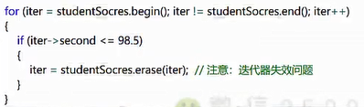

## STL模板库

它是泛型的，不与特定数据结构和对象绑定。它有六大组件：

### 容器

#### 序列式容器

可排序，STL提供了vector、list、deque等序列式容器，stack（基于deque）、queue（基于deque）、priority_queue是容器适配器。

基本的使用见

#### 关联式容器

每个数据元素都由一个key和value组成，STL提供了set、map、multiset、multimap等关联式容器。

迭代器的erase删掉当前iter后，iter会失效，但返回值是删除后下一个迭代器的位置。因此for循环中使用时需要注意。

### 仿函数

也称为**函数对象**，是一个能行使函数功能的类，仿函数的语法和普通的函数调用一样，只是作为仿函数的类必须重载operator()运算符。一般不会单独使用，配合STL算法使用。主要是因为函数指针不能满足STL对于抽象性能的要求。

本质是类重载了一个operator()，创建了一个行为类似函数的对象。

其中的mysort和display是自定义的函数，实现类似下图：

结合泛型的思想，使得应用场景更加广泛，定义如下：

使用方式如下：

仿函数的定义如下：

调用方式如下：

改为泛型如下：

### 算法

STL将算法分为4类，大概70多种，包含于<algorithm>、<numeric>、<functional>中。

1. 非可变序列算法：不直接修改其所操作的容器内容的算法；
2. 可变序列算法：可修改其所操作的容器内容的算法；
3. 排序算法：对序列进行排序和合并的算法、搜索算法以及有序序列上的集合操作；
4. 数值算法：对容器内容进行数值计算。

上图有**lambda表达式**，[]表示外部传递的参数，->表示返回类型。大括号里是函数语句。

### 迭代器

若要自定义迭代器，需要实现iterator_traits的五种特性：

### 容器适配器

比如stack、queue基于deque，priority_queue（默认最大值优先）基于vector。它们基于序列容器做了**封装**，在序列容器的基础之上提供了不同的功能。之所以被称为适配器类，是因为它可以通过适配容器现有的接口来提供不同的功能。

### 空间配置器

对于new，都是先配置内存，然后调用对应的构造函数。delete则是先调用对应的析构函数，然后释放内存。