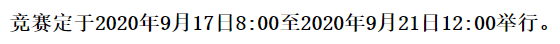
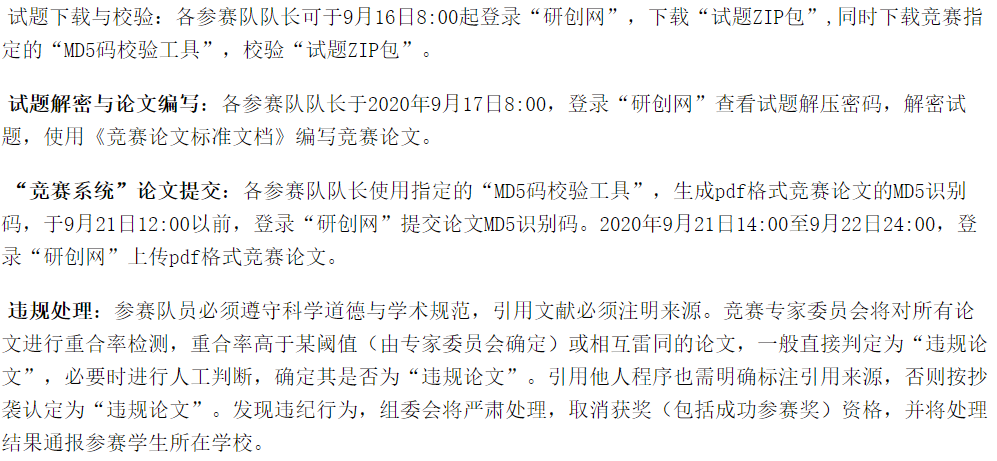

## 华为杯数学建模比赛

### 前期准备

- 好的数学模型：大致浏览数模的书籍，大概知道有哪些常用的模型。对于算法的求解方法要好，即快速、准确的给出最优解。
- 高质量的论文：论文需要把建模过程和求解过程描述清楚。
- 重视建模论文的模板和技巧：建模论文至少要包括问题、假设、模型、求解、结果、评价。多看几篇建模论文。
- 合理时间安排：定进度表，一小时内确定选那个题，第一天建好模型确定求解方法。最好白天完成这一项。有四天半，时间上非常充裕。

http://www.math.zju.edu.cn/2020/0603/c38121a2147728/page.htm

#### 时间分配：

- 第一天定模型、选求解方法，第一天晚上开始编程，到第二天肯定要搞完，包括画图这些。第三天和第四题论文、图。第四天上午细致的检错，确认无误上交。

#### 注意事项：

https://zhuanlan.zhihu.com/p/215274409

#### 分工：

论文：江培玲

编程：左家乐

建模：伍尹洁

#### 具体题型讨论：

2019年F题：航迹规划

##### 题目理解：

- 全程的垂直水平误差 <    30
- 每飞行1m 误差累加δ=0.001
- 垂直误差校正条件：垂直误差<=25,水平误差<=15
- 水平误差校正条件：垂直误差<=20,水平误差<=25
- 校正次数足够少，且距离更短

### 2015-2019题型总结：

#### 2019

A题：无线智能传播模型，机器学习

B题：星图识别，姿态解算，特征提取，角距匹配，特征匹配

C题：视频图像信息分析，SFM slam 坐标系变换

D题：汽车行驶工况构建，**k-means聚类分析**，主成分分析，深度学习

E题：变暖气候预测，ARIMA自回归，随机森林，**多目标规划**

F题：航迹规划，使用图论求最短路径，可使用迪杰斯特拉、**蚁群算法、贪心算法**、dubins曲线求解

#### 2018

A题：跳水体型系数 理论力学 

B：光传送网建模与价值评估 图论 迪杰斯特拉 生成树 模拟退化 遗传算法

C：数据量化分析 k-means聚类 机器学习

D：调和分析、多项式拟合，最小二乘法

E:禁忌搜索算法，路径规划、协同干扰、组网雷达

F:多目标多约束，遗传算法，模拟退火，蚁群算法，禁忌搜索

#### **2017：**

A；多无人机，模拟退火，遗传算法，粒子群

B:遗传算法，粒子群PSO，最小二乘，多目标优化，多约束

C:贪婪算法，模拟退火

D:vibe算法，特征提取

E:聚类分析，动态规划，floyd算法，0-1规划，迪杰斯特拉，多目标优化，博弈论

F:最小生成树，

#### 2016

A:无人机，聚类，多目标，遗传算法，粒子群

B:聚类分析，卡方检验

C:非线性规划，最小二乘

D:路径规划，模拟退火 ，迪杰斯特拉

E:线性规划，多目标，遗传算法

#### 2015

B：聚类

D：遗传算法

F：TSP规划 模拟退火 蚁群算法 0-1变量

### 算法模型学习

#### 模拟退火

它本身是**求解最小值问题**，也可以求解最大值。出发点是基于物理中固体物质的退火过程与一般的**组合优化问题**之间的相似性。它是一种通用的优化算法，物理退火过程由三部分组成：

- 加温过程，增强粒子的热运动，使其偏离平衡位置。
- 等温过程，自由能最小时，系统达到平衡状态。
- 冷却过程，粒子热运动减弱，系统能量下降。

加温<->算法**设定初值**，等温对应于**metropolis抽样过程**，冷却对应于**控制参数的下降**。能量的变化是目标函数。得到的**最优解**是**能量最低态**。其中metropolis准则是SA算法收敛于全局最优解的关键，它以一定的概率接受恶化解，是算法脱离局部最优的陷阱。

原理参考链接：https://www.cnblogs.com/flashhu/p/8884132.html

有matlab代码：https://blog.csdn.net/viafcccy/article/details/94881458

#### 粒子群(PSO, particle swarm optimization)

它是计算智能领域，除了蚁群算法、鱼群算法之外的一种群体智能的优化算法，它的思想是模拟鸟群随机搜索食物的捕食行为，鸟群通过自身经验与种群间交流等调整自己的搜寻方向，从而找到食物最多的地点。每个鸟的**位置**和**路径**是**自变量组合**，每次到达的地点的**食物密度**是**函数值**。这样的过程称为跟踪极值，从而找到最优解。

粒子群收敛于全局最优解的概率很大，相较于传统算法，它有以下优点：

- 计算速度快，全局搜索能力强；
- 对于种群大小不敏感，初始种群一般设为500-1000，速度影响不大；
- 粒子群算法适用于**连续函数极值问题**，**非线性**、**多峰问题**有较强的全局搜索能力。

参考链接：https://blog.csdn.net/nightmare_dimple/article/details/74331679

#### 遗传算法

它是模拟达尔文生物进化论的自然选择和遗传学机理的生物进化过程的计算模型，通过模拟自然进化过程搜索**最优解**的方法。

遗传算法就是很笨的一个个**搜索**，只不过人为的给它加了计算的方向和策略，让它有目的的算。

遗传算法首先是选择个体(即x值)，个体一般是20-100个之间。然后进行**编码**，然后**变异**，**交叉**。然后是**选择**，不停地选择使种群一直朝好的方向走。

https://www.cnblogs.com/LoganChen/p/7509702.html

#### 蚁群算法

#### 0-1变量

#### 聚类

#### 图论求最短路径

