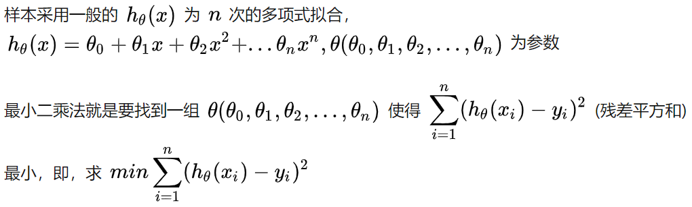
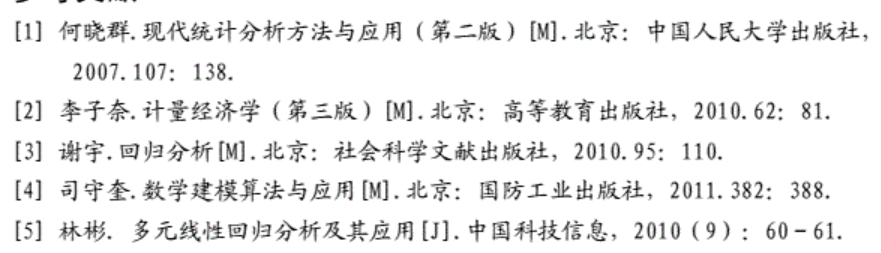
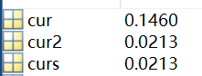
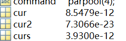
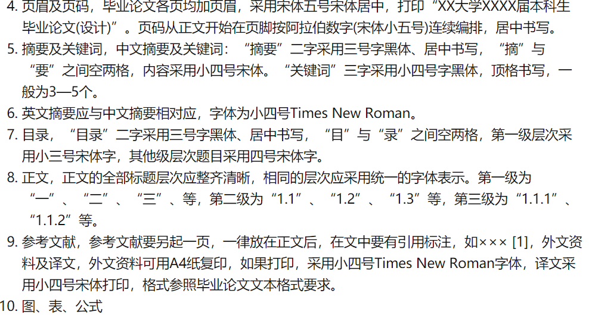

## 华为杯数学建模比赛

### 前期准备

- 好的数学模型：大致浏览数模的书籍，大概知道有哪些常用的模型。对于算法的求解方法要好，即快速、准确的给出最优解。
- 高质量的论文：论文需要把建模过程和求解过程描述清楚。
- 重视建模论文的模板和技巧：建模论文至少要包括问题、假设、模型、求解、结果、评价。多看几篇建模论文。
- 合理时间安排：定进度表，一小时内确定选那个题，第一天建好模型确定求解方法。最好白天完成这一项。有四天半，时间上非常充裕。

http://www.math.zju.edu.cn/2020/0603/c38121a2147728/page.htm

#### 时间分配：

- 第一天定模型、选求解方法，第一天晚上开始编程，到第二天肯定要搞完，包括画图这些。第三天和第四题论文、图。第四天上午细致的检错，确认无误上交。

#### 注意事项：

https://zhuanlan.zhihu.com/p/215274409

#### 分工：

论文：江培玲

编程：左家乐

建模：伍尹洁

#### 具体题型讨论：

2019年F题：航迹规划

##### 题目理解：

- 全程的垂直水平误差 <    30
- 每飞行1m 误差累加δ=0.001
- 垂直误差校正条件：垂直误差<=25,水平误差<=15
- 水平误差校正条件：垂直误差<=20,水平误差<=25
- 校正次数足够少，且距离更短

### 2015-2019题型总结：

#### 2019

A题：无线智能传播模型，机器学习

B题：星图识别，姿态解算，特征提取，角距匹配，特征匹配

C题：视频图像信息分析，SFM slam 坐标系变换

D题：汽车行驶工况构建，**k-means聚类分析**，主成分分析，深度学习

E题：变暖气候预测，ARIMA自回归，随机森林，**多目标规划**

F题：航迹规划，使用图论求最短路径，可使用迪杰斯特拉、**蚁群算法、贪心算法**、dubins曲线求解

#### 2018

A题：跳水体型系数 理论力学 

B：光传送网建模与价值评估 图论 迪杰斯特拉 生成树 模拟退化 遗传算法

C：数据量化分析 k-means聚类 机器学习

D：调和分析、多项式拟合，最小二乘法

E:禁忌搜索算法，路径规划、协同干扰、组网雷达

F:多目标多约束，遗传算法，模拟退火，蚁群算法，禁忌搜索

#### **2017：**

A；多无人机，模拟退火，遗传算法，粒子群

B:遗传算法，粒子群PSO，最小二乘，多目标优化，多约束

C:贪婪算法，模拟退火

D:vibe算法，特征提取

E:聚类分析，动态规划，floyd算法，0-1规划，迪杰斯特拉，多目标优化，博弈论

F:最小生成树，

#### 2016

A:无人机，聚类，多目标，遗传算法，粒子群

B:聚类分析，卡方检验

C:非线性规划，最小二乘

D:路径规划，模拟退火 ，迪杰斯特拉

E:线性规划，多目标，遗传算法

#### 2015

B：聚类

D：遗传算法

F：TSP规划 模拟退火 蚁群算法 0-1变量

### 算法模型学习

#### 模拟退火

它本身是**求解最小值问题**，也可以求解最大值。出发点是基于物理中固体物质的退火过程与一般的**组合优化问题**之间的相似性。它是一种通用的优化算法，物理退火过程由三部分组成：

- 加温过程，增强粒子的热运动，使其偏离平衡位置。
- 等温过程，自由能最小时，系统达到平衡状态。
- 冷却过程，粒子热运动减弱，系统能量下降。

加温<->算法**设定初值**，等温对应于**metropolis抽样过程**，冷却对应于**控制参数的下降**。能量的变化是目标函数。得到的**最优解**是**能量最低态**。其中metropolis准则是SA算法收敛于全局最优解的关键，它以一定的概率接受恶化解，是算法脱离局部最优的陷阱。

原理参考链接：https://www.cnblogs.com/flashhu/p/8884132.html

有matlab代码：https://blog.csdn.net/viafcccy/article/details/94881458

#### 粒子群(PSO, particle swarm optimization)

它是计算智能领域，除了蚁群算法、鱼群算法之外的一种群体智能的优化算法，它的思想是模拟鸟群随机搜索食物的捕食行为，鸟群通过自身经验与种群间交流等调整自己的搜寻方向，从而找到食物最多的地点。每个鸟的**位置**和**路径**是**自变量组合**，每次到达的地点的**食物密度**是**函数值**。这样的过程称为跟踪极值，从而找到最优解。

粒子群收敛于全局最优解的概率很大，相较于传统算法，它有以下优点：

- 计算速度快，全局搜索能力强；
- 对于种群大小不敏感，初始种群一般设为500-1000，速度影响不大；
- 粒子群算法适用于**连续函数极值问题**，**非线性**、**多峰问题**有较强的全局搜索能力。

参考链接：https://blog.csdn.net/nightmare_dimple/article/details/74331679

#### 遗传算法

它是模拟达尔文生物进化论的自然选择和遗传学机理的生物进化过程的计算模型，通过模拟自然进化过程搜索**最优解**的方法。

遗传算法就是很笨的一个个**搜索**，只不过人为的给它加了计算的方向和策略，让它有目的的算。

遗传算法首先是选择个体(即x值)，个体一般是20-100个之间。然后进行**编码**，然后**变异**，**交叉**。然后是**选择**，不停地选择使种群一直朝好的方向走。

https://www.cnblogs.com/LoganChen/p/7509702.html

#### 蚁群算法

模拟蚂蚁觅食行为的模拟优化算法，可以应用在解决TSP问题上。

计算过程如下：

- 初始化
- 为每只蚂蚁选择下一个节点
- 更新信息素矩阵
- 检查终止条件

https://zhuanlan.zhihu.com/p/113629381

#### 0-1变量

决策变量只能取值0或者1的一类特殊的整数规划，通常是线性规划。

#### 层次分析法(AHP)

在对复杂的**决策问题**的本质、影响因素及其内在关系等进行深入分析的基础上，利用较少的定量信息使决策的思维过程数学化。为多目标、多准则或者无结构特性的复杂决策问题提供简便的决策方法。

使用该方法时，大致分为以下步骤：

- 建立层次结构模型
- 构造判断(成对比较)矩阵
- 层次单排序及其一致性检验
- 层次总排序及其一致性检验

#### 多属性决策模型

它本质上利用已有的决策信息通过一定的方式对一组备选方案进行排序或择优。它主要由两部分组成：

- 获取决策信息
- 通过一定的方式对决策信息进行集结并对方案进行排序和择优

信息集结的方式有：加权算术平均(WAA)算子、加权几何平均(WGA)算子、有序加权平均(OWA)算子。

#### 灰色预测模型(gray forecast model)

将既含有已知信息也含有未知信息的系统称为灰色系统。根据**少量、不完全**的信息，建立数学模型并做出预测的一种预测方法。目前常用的一些预测方法需要较大的样本，若样本较小，会造成较大误差。而灰色预测模型需要的建模信息少，运算方便，**建模精度高**。常用来处理**小样本预测**问题。主要是以累加生成、累减生成、均值生成、级比生成等方式作为灰色系统生成的方式。

#### 种群竞争模型

使用种群竞争模型描述两个种群相互竞争的过程，分析产生各种可能结局的条件。

#### 线性规划问题

求线性目标函数在**线性约束条件**下的最大值或者最小值，统称为线性规划问题。

#### 主成分分析(principal component analysis, PCA)

将多个变量通过线性变换以选出较少个数重要变量的一种多元统计分析方法。

#### 聚类

建立一种分类方法，将一批样本数据按照他们在性质上的亲密程度，在无先验只是的情况下进行**分类**。

#### 最小二乘法

最小二乘适用于回归直线分析，当数据测量值趋近于直线分布时，就可以使用最小二乘法。也可以做曲线拟合。

多目标多约束

### 选题

经过讨论选择B题

### 第一问 处理285和313行数据

预处理方法是求均值，然后比较

第二问

核PCA相较于PCA：

主要就在于核PCA先进行升维，然后进行中心化，然后核函数进行求解，然后按照PCA的方法继续做。

参考文献：

先对S含量的各个变量进行变化，保存每个变量变化之后的辛烷值和硫含量变化轨迹。然后继续优化。

首先是优化S，每次变化一个单位，然后截图。

精制汽油出装置硫含量+1，同时画了加2-3的图，最后发现还是+1的最好

改变R-102底喷头压差的值没有影响。

改变K-103A进气温度的值没有影响。

R-102 #3通风挡板温度无影响。

主成分之所以只有303，是因为进行了筛选。

对于主成分-BP方法，得到的三个误差为：

对于主成分随机森林，得到的误差为：

参考文献：

[1] 扬斌, 田永强, 朱仲英. 智能建模方法中的数据预处理[J]. 信息与控制, 2002, 31(4):380-384.

[2] 李翠英. 智能建模中化工数据的处理[J]. 重庆科技学院学报,2012, 14(2):156-158.

[3] 齐万松, 姬晓军, 侯玉宝, 秦正军. S Zorb 装置降低汽油辛烷值损失的探索[J]. 炼油技术与工程, 2014, 44(11):5-10.

[4]苟倩倩,赵明生,池恩安,何兴贵,黄胜松.基于PCA-BP神经网络在爆破振动评价要素中的预测及应用[J].矿业研究与开发,2018,38(12):97-102.

[5]张忆,龚志千.基于BP神经网络的气体管道泄漏检测方法[J].电子设计工程,2020,28(17):142-147.

[6]. Science - Mechanical Science; North China Electric Power University Reports Findings in Mechanical Science (Analysis On Mass Flow Rate of R22 and R407c Through Coiled Adiabatic Capillary Tubes With Ga and Pso Optimized Bp Networks)[J]. Journal of Technology,2020.

[7]刘红,党晓东,都全胜,马润年,白石轮.基于随机森林算法的日光温室内气温预测模型研究[J].中国农学通报,2020,36(25):95-100.

[8]Shan Feng,Jing Li,Guoqi Qian,Baili Feng. Association between the yield and the main agronomic traits of Tartary buckwheat evaluated using the random forest model[J]. Crop Science,2020,60(5).

[9]李婉,牛陆,陈虹,吴骅.基于随机森林算法的地表温度鲁棒降尺度方法[J].地球信息科学学报,2020,22(08):1666-1678.

### 思路解析：

针对第一问，采用的方法是按照题目附件2要求删除不合规范的数据。

针对第二问筛选主要建模变量，使用的方法是主成分分析法和随机森林选取权重排序高的元素的方法。

针对第三问，使用PSO-BP神经网络和随机森林回归模型作为预测模型，预测得到RON损失值和硫的值，再代入matlab进行比较，查看哪种模型更好。

针对第四问，使用将每次的值都带进去迭代，选取一个迭代次数，完成迭代次数后达到RON大于30%且硫含量小于5的即为满足条件的。

针对第五问，选取第133号样本的数据向第四问中迭代1000次后的结果进行逼近，逼近的过程中每迭代一次就预测一次，最后记录整个轨迹变化。