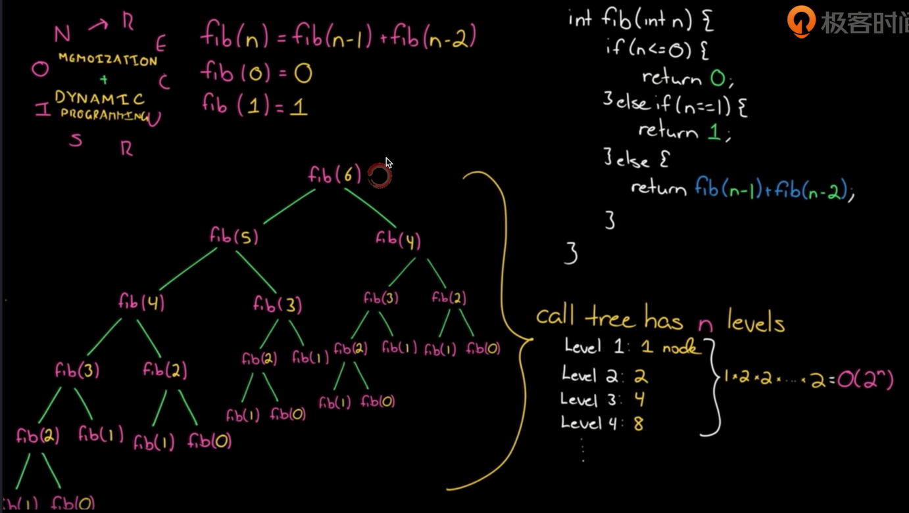
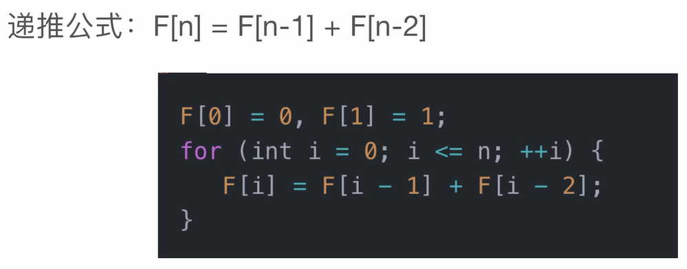
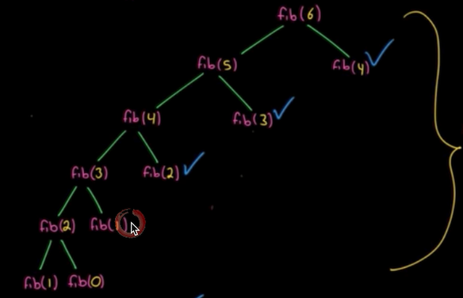
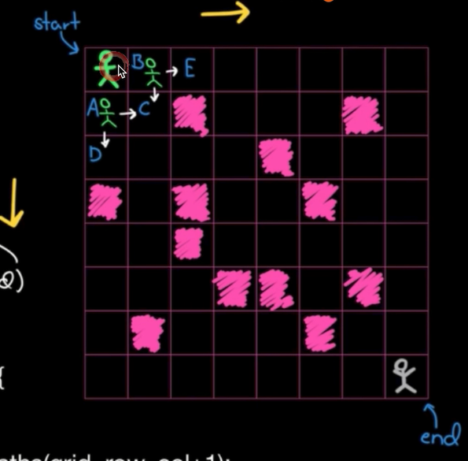
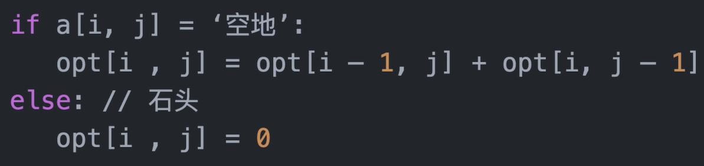
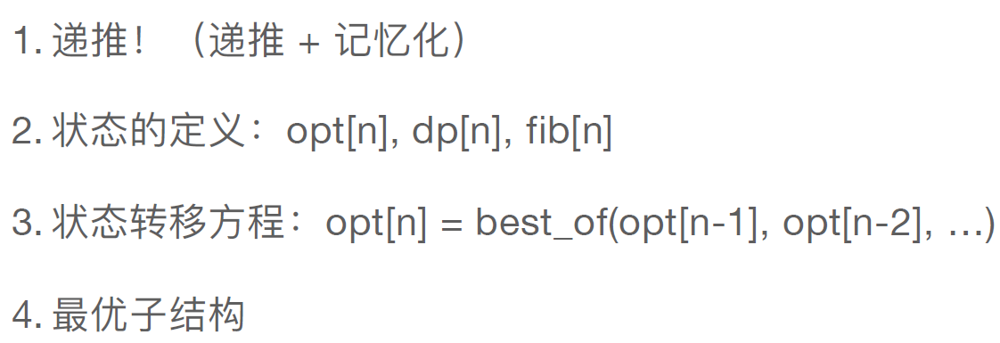
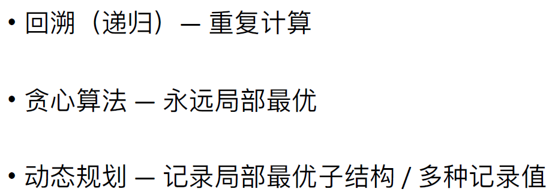

# 动态规划

### 1、斐波那契

说到斐波那契，第一反应是：

用简单的递归自上而下，但是这样的时间复杂度是O(n^2)，费时。

因此较好的改善方法是对它进行记忆化，添加缓存比如数组，将已经计算过的进行保存，以避免重复计算。再优化一下的话可以将递归的顺序改为从下至上，因为一开始能得到的值是n为0和1时的值。

此时递归树为：

此时时间复杂度为O(n)，因为n为多大就计算了多少个值，并缓存了一些值。

对于动态规划，最重要的是：**最优子结构**、**状态转移方程**、**边界条件**。

### 2、可走路径数

题目描述为：

这一题同样是动态规划，且为了减少时间复杂度，使用缓存数组记录已走过的状态。得到状态转移方程为：

### 3、动态规划总结

动态规划的思路大致如下：

### 4、回溯、贪心与动态规划对比

