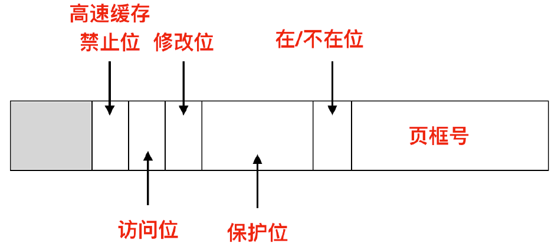

### 段

从逻辑层面操作系统把数据分成不同的段来存储。

#### 代码段(textsegment)

又称文本段，用来存放指令、运行代码的一块内存空间。

其空间大小在代码运行前就已经确定。

#### 数据段(datasegment)

可读可写，存储初始化的全局变量和初始化的static变量。

数据段中数据的生存期随进程的生存期。

#### bss段(bsssegment)

可读可写，存储未初始化的全局变量和未初始化的static变量。

#### 栈(stack)

存储的是函数或代码中的局部变量，栈的生存期随代码块持续性。

#### 堆(heap)

存储的是程序运行期间动态分配的空间。

### 内存

存储器系统采用的是分层次的结构：

#### 寄存器

CPU中的寄存器，程序需在软件中自行决定如何使用。

#### 高速缓存

内存分为主存和 **cache**，高速缓存行(cache lines)是 CPU cache 中的最小缓存单位，一般主流的是 64 字节。内存地址中的 0-63 对应高速缓存行 0，64-127 对应 1，等等。使用最频繁的 cache lines 保存在位于 CPU 内部或非常靠近高速缓存中。

##### 高速缓存行命中

应用程序需要从内存中读取关键词时，高速缓存的硬件检查所需要的高速缓存行是否在高速缓存中，若在就是命中（一般花费 2 个时钟周期）。缓存未命中需要从内存中提取，会消耗大量的时间。

##### 两种缓存

第一级是 L1 cache，位于 CPU 内部，用于将已解码的指令调入 CPU 的执行引擎。大小一般为 16KB。往往还设有 2 级缓存，L2 cache 用于存放最近使用的关键字，一般兆字节大小。

两者的区别在于：

1. 访问L1 cache 没有任何延迟，访问 L2 会有 1-2 个时钟周期的延迟。

##### 时钟周期

振荡器两个脉冲之间的时间量。因此每秒脉冲数越高，计算机处理器处理信息的速度越快。现代处理器每个时钟周期可以执行多条指令。

#### 主存

被称为 RAM(Random Access Memory)，所有不能在高速缓存中得到的内存访问请求会转往主存。

ROM(Read Only Memory) 中的内容一经存储就不会再修改，非常快且便宜。计算机中，用于启动计算机的引导加载模块 (bootstrap) 存放在 ROM 中。

#### 空闲内存管理

有两种管理内存使用的方式：

- 位图(bitmap)
- 空闲列表(free lists)

##### 使用位图的存储管理

使用位图方法时，内存可能被划分为小到几个字节或大到几千字节的分配单元。每个分配单元对应位图中的一位，0表示空闲，1表示占用。

##### 使用链表进行管理

维护一个记录已分配内存段和空闲内存段的链表，段会包括进程或者是两个进程的空闲区域。按照地址顺序在链表中存放进程和空闲区。

在分配内存时，先假设内存管理器知道应该分配多少内存，可以使用首次适配算法(first fit)，内存管理器会沿着段列表进行扫描，直到找到一个足够大的空间，当空闲区大小比要分配的内存大小更大时，会将空闲区分成两部分，一部分供进程使用，一部分生成新的空闲区。

还有最佳适配(best fit)，最佳适配从头到尾寻找整个链表，直到找到能容纳进程的最小空闲区。

### 虚拟内存

虚拟内存的基本思想是：每个程序都有自己的地址空间，这个地址空间被划分为称为页面的块。

每个页都是连续的地址范围，这些页被映射为物理内存。当程序引用到一部分在物理内存中的地址空间时，硬件会立刻执行必要的**映射**。当程序引用到一部分不在物理内存中的地址空间时，由操作系统负责**将缺失的部分装入物理内存**并重新执行失败的指令。

#### 分页

使用虚拟内存时，MMU(memory management unit)内存管理单元会把虚拟地址映射为物理内存地址。

虚拟地址空间由固定大小的单元组成，这种固定大小的单元称为**页**。物理内存中也有固定大小的物理单元，称为**页框**。页和页框的大小一样，是4KB。实际使用过程中，页的大小范围可能是512字节-1GB字节的大小。RAM(Random Access Memory，主存)和磁盘间的交换总是以整个页为单位进行交换的。

由于虚拟内存一般与物理内存大，因此所有的虚拟页不可能全部被映射到物理内存中。所以一般会使用**在或者不在的位**记录页面在内存中的实际存在情况。

#### 未映射的页如何映射

当程序访问一个未映射的页面时，此时MMU注意到该页面没有被映射，因此CPU会`陷入(trap)`到操作系统中，这个trap称为**缺页中断(page fault)**或是缺页错误。操作系统会选择一个很少使用的页并把它的内容写入到磁盘上，然后把需要访问的页面读到刚才回收的页框中，修改映射关系，然后重新启动引起陷入的指令。

`缺页异常`发生在虚拟地址无法映射到物理地址的时候。

#### 页表

虚拟地址与物理地址的映射关系：**虚拟地址**被分为**虚拟页号**(高位部分)和**偏移量**(低位部分)，比如对于16位地址和4KB的页面大小，高4位指定16个虚拟页面中的一页，低12位确定所选页面中的偏移量。

通过映射后能发现物理页框号是通过虚拟页号(虚拟地址前4位)作为页表中的索引找到的。

##### 页表项的构成

一般来说页表项都是32位的，页表项中最重要的字段是==页框号(page frames)==，还有`在/不在位`，若此位上的值是1，则页表项是有效的并且能够被使用，若值为0，表示该页表项对于的虚拟页面不在内存中，访问该页面会引起缺页异常。

`保护位`告诉我们哪个访问是允许的，0表示可读可写，1表示只读。

`修改位(modified)`和`访问位(referenced)`会跟踪页面的使用情况。当一个页面被写入时，硬件会自动设置修改位。若一个页面被修改过，那么它是`脏`的，需要把它写回磁盘。若没修改过，那么重新分配时这个页框会被直接丢弃。

访问位在页面被访问时设置，这个值能帮助系统在发生缺页中断时选择要淘汰的页。不再使用的页更容易被淘汰。

最后一位用于**禁止该页面被高速缓存**，对于具有独立的I/O空间而不是用内存映射I/O的机器来说，并不需要这一位。

`操作数`：计算机指令中的一个组成成分，它规定了指令中进行数字运算的量。操作数指出指令执行需要数据的来源。

#### 转换检测缓冲区(Translation Lookaside Buffer, TLB)

由于大多数程序总是对少量页面多次访问，因此可以设置一个小型的硬件设备，能够将虚拟地址直接映射到物理地址，而不必再访问页表。

TLB通常位于MMU中，包含少量的表项，每个表项都记录了页面的相关信息。

它实质上是一种内存缓存，用于减少访问内存所需要的时间，它是MMU的一部分，TLB会将虚拟地址到物理地址的转换存储起来，称为地址翻译缓存(address-translation cache)。TLB通常位于CPU和CPU缓存之间，与CPU缓存是不同的缓存级别。

当一个MMU的虚拟地址需要进行转换时，硬件首先检查虚拟页号和TLB中的所有表项进行并行匹配，判断虚拟页是否在TLB中。找到有效匹配项且要进行的访问操作没有违反保护位的话，将**页框号直接从TLB中取出**而不用再直接访问页表。

若不在TLB中，就进行正常的页表查找。然后从TLB中逐出一个表项然后把从页表中找到的项放在TLB中。

#### 多级页表

引入TLB加速了**虚拟地址到物理地址的转换**，那么还有一个问题是如何处理巨大的虚拟地址空间。

引入多级页表是为了避免把全部页表一直保存在内存中，那些从不需要的页表不应该保留。

32位的虚拟地址会被分割成如下几个部分：

在实际的工作过程中，最左边的是顶级页表，它有1024个表项，对应于10位的PT1域。当一个虚拟地址被送到MMU时，MMU首先提取PT1域并把该值作为访问顶级页表的索引。逐级查找的过程见下链接：https://blog.csdn.net/qq_22238021/article/details/80176099

#### 倒排页表

对于64位虚拟地址空间，使用多级页表会占用非常大的内存，这是没有必要的，解决方案之一是使用倒排页表。实际内存中的每一个页框对应一个表项，而不是每个虚拟页面对应一个表项。它的缺陷在于：从虚拟地址到物理地址的转换很困难。当进程要访问虚拟页面时，硬件必须搜索整个倒排页面来查找某个表项。

为了使倒排页表更快，同样引入了TLB。TLB记录所有频繁使用的页面。当TLB失效时，需要用软件搜索整个倒排页表。一个可行的实现该搜索的方法是建立一张散列表，用虚拟地址来散列。

#### 页面置换算法

OneNote中有物理内存管理笔记，里面记录了伙伴系统等知识。

发生缺页异常时，操作系统会选择一个页面进行换出从而为新进来的页面腾出空间。若要换出的页面在内存中已经`被修改`，那么必须将其写到磁盘从而使磁盘副本保持最新状态。若页面没有被修改过，则直接使用调入的页面覆盖需要移除的页面即可。有很多页面置换算法(page replacement algorithms)用于页面置换。

##### 最近未使用页面置换算法

大部分使用虚拟地址的计算机都有两个状态位，R和M，来和每个页面进行关联。每当**页面被访问时**都设置`R`，**写入页面**时设置`M`，这些位包含在每个页表项中。当启动一个进程时，将其所有的页面都标记为不在内存；一旦**访问一个页面**就会**引发一次缺页中断**，此时操作系统可以设置R位，修改页表项将其指向正确的页面，并设置为`READ ONLY`模式，然后重新启动引起缺页中断的指令。当页面被修改，就会发生另一个缺页异常，允许操作系统设置M位并把页面的模式设置为READ/WRITE。

用R位和M位构造一个简单的页面置换算法：启动一个进程时，操作系统将所有页面的两个位都设置为0。R为**定期被清零**(在每个时钟中断)，用来区分最近未引用的页面和已引用的页面。

出现缺页中断时，操作系统会检查所有页面，有以下几类：

- 第0类：没有引用R，没有修改M
- 第1类：没有引用R，已修改M
- 第2类：引用R，没有修改M
- 第3类：已被访问R，已被修改M

`NRU(Not Recently Used)`算法会从编号最小的非空类中随即删除一个页面，因为在一个时钟内淘汰一个已修改但没有被访问的页面要比一个大量引用的未修改的页面好。

##### 先进先出页面置换算法FIFO(First-In,First-Out)

由操作系统维护一个所有在当前内存中的页面的链表，最早进入的放入表头，最新进入的页面放在表尾。发生缺页异常时，将头部的页移除并把新的页添加到表尾。

##### 第二次机会页面置换算法(second chance)

由于FIFO在出链和入链时不会进行检查，因此容易把经常使用的页面置换出去。为了避免这一问题，因此**检查最老页面的R位**，若是0，说明这个页面就是最老的且没有被使用。那么这个页面就会立刻被换出。若R位为1，就清除此位，此页面会被放在链表的尾部，修改它的装入时间就像刚被放进来的一样。然后继续搜索。

寻找第二次机会的是在最近的时钟间隔中未被访问过的页面。若所有的页面都被访问过，该算法退化为FIFO算法。

##### 时钟页面置换算法

把所有页面保存在一个类似钟型的环形链表中，一个表针指向最老的页面。

##### 最近最少使用页面置换算法LRU(Least Recently Used)

在内存中维护一个所有页面的链表，最频繁使用的页位于表头，最近最少使用的页位于表尾。比较麻烦的是在每次内存引用时更新整个链表。在链表中找到一个页面，删除它，然后把它移动到表头是一件很耗时的操作。

使用NFU(not frquently used)算法来实现它。NFU需要一个软件技术器和每个页面关联，初始化时为0，在每个时钟中断时，操作系统会浏览内存中的所有页，将每个页面的R位加到它的计数器上去。这个计数器就能大致跟踪各个页面访问的频繁程度。当缺页异常时，置换计数器值最小的页面。

对NFU进行修改可以得到`老化`算法：

- 在R位被添加进来之前先将计数器右移1位；
- R位被添加到最左边的位而不是最右边的位。

##### 工作集页面置换算法

一个进程当前正在使用的页面的集合称为它的`工作集(working set)`，由于很多个页面的缺页异常会降低程序运行的速度，因此分页系统会跟踪进程的工作集，确保这些工作集在进程运行时被调入内存，这种方法被称为**工作集模式**。这可以减少缺页中断的次数。在进程首先装入工作集页面的这个过程称为预先调页。

### 磁盘

信息写在磁盘一系列的同心圆中，这一圈圈圆就是一个个**磁道(track)**，相同半径的磁道组成**柱面(cylinder)**。

每个磁道能划分成多个扇区，扇区的值为512字节。

### 进程

计算机系统中，`逻辑流`有许多不同的形式，比如异常处理程序、进程等。进程是正在运行的程序的一个抽象。在多道程序系统中，CPU会在进程间快速切换，使每个程序运行几十或几百毫秒，这是`并发`。单个处理器可以被若干个进程共享，CPU使用某种调度算法决定何时停止一个进程的工作。一个进程执行它的控制流的一部分的每一时间段叫`时间片(time slice)`。因此多任务也称为时间分片。

#### 进程的创建

##### 系统初始化（init）

启动操作系统时，其中有些是**前台进程**（numerous process），即同用户交互并替他们完成工作的进程。大部分运行在后台。运行在后台的称为**守护进程**（daemous）。

##### 系统调用创建

进程可以发出系统调用fork来创建一个或多个新的进程，系统调用是通过一条称为**syscall**的陷阱指令提供的。新创建的子进程几乎完全与父进程相同，子进程会得到**父进程用户级虚拟地址空间**的一份副本，包括代码和数据段、堆、共享库及用户栈。子进程能得到与父进程**打开文件描述符**相同的副本。子进程与父进程的区别在于pid不同。

父进程中，fork返回**子进程的pid**；子进程中fork返回0。并且父进程和子进程是并发运行的独立进程。

##### 用户请求创建

交互式系统中，输入一个命令或者双击图标启动程序就是开启了一个新的进程。

##### 批处理创建

应用于大型机的批处理系统。用户在这种系统中提交批处理作业。

在Unix中，只有系统调用fork能创建一个新进程。fork后，父子进程拥有相同的内存映像，但子进程会执行execve或者简单的系统调用来改变内存映像并运行一个新的程序。

#### 进程的终止

##### 正常退出

完成了工作而终止。比如编译器完成了所给程序的编译之后，编译器就执行一个系统调用告诉操作系统它完成了工作，这个系统调用是exit。

##### 错误退出

进程终止的一个可能原因是发生严重错误。

##### 严重错误

有时由于程序中的错误，比如执行了一条非法指令，引用了不存在的内存。此时进程可以通知操作系统，它希望自行处理某种类型的错误。在这类错误中，进程会收到信号（中断）。

##### 被其它进程杀死

某个进程可以执行系统调用告诉操作系统杀死某个进程。系统调用命令是kill。

####  Unix进程体系

进程和它的子进程以及子进程的子进程共同组成一个**进程组**。当用户从键盘发出一个信号后，该信号会被**发送给**当前与键盘相关的进程组的**所有成员**。

Unix在启动时，有一个称为init的特殊进程出现在启动映像中。围绕它会创建很多进程，它为根。

#### 进程的状态

##### 运行态

进程实际占用CPU时间片运行

##### 就绪态

可运行，但因为其他进程正在运行而处于就绪状态

##### 阻塞态

除非某种外部事件发生，否则进程不能运行

#### 进程的实现

操作系统维护一张表，叫`进程表`，这个表方便操作系统**执行进程间的切换**。每个进程占用一个进程表项，里面包含了程序计数器、堆栈指针、内存分配情况、打开文件的状态、账号和调度信息，以及进程状态切换时所必须保存的信息。

#### 中断调用的实现

每个IO类关联了一个中断向量，它包含中断服务程序的入口地址，中断发生时，正在运行的进程的程序计数器、程序状态字等信息会被压入堆栈，计算机随即跳转到中断向量指示的地址。

中断结束后，操作系统使用**调度程序决定**接下来**运行**哪个进程，然后将**控制权转移**给**一段汇编语言代码**。为即将要运行的进程**装入寄存器值**以及内存映射，并**启动该进程运行**。

#### 用户模式和内核模式

处理器一般使用某个控制寄存器中的一个**模式位**描述进程当前享有的特权。当设置了模式位时，进程运行在内核模式；未设置时，运行在用户模式中。Linux提供了一种聪明的机制，叫做`/proc文件系统`，允许用户模式进程访问内核数据结构的内容。/proc文件系统将许多内核数据结构的内容输出为一个用户程序可以读的**文本文件的层次结构**。`/sys文件系统`输出关于系统总线和设备的额外的底层信息。

#### 上下文切换

操作系统内核使用称为`上下文切换(context switch)`的较高层形式的异常控制流来实现多任务。上下文切换机制建立在已经讨论过的较低层异常机制之上。

内核为每个进程维护一个上下文，上下文是内核重新启动一个被抢占的进程**所需的状态**。上下文切换包括：

- 保存当前进程的上下文
- 恢复某个先前被抢占的进程被保存的上下文
- 将控制传递给这个新恢复的进程

### 线程

CPU上调度执行的实体，多线程模型：

调度线程读入工作请求->选择一个空闲的工作线程处理请求（将消息的指针写入每个线程关联的特殊字中）->工作线程的状态由阻塞态变为就绪态

工作线程去高速缓存中查找请求页面->若不在就使用read从磁盘中获取页面并阻塞线程直到磁盘操作完成

上述工作线程阻塞时，调度线程可以将另一个线程投入运行

同一进程中的线程有完全一样的地址空间，它们共享同样的全局变量，但它们也具有不同的内容：

线程具有四种状态：阻塞、运行中、就绪和终止。

#### 线程实现

##### 用户空间实现线程

在用户空间管理线程时，每个进程都有一个线程表，用于跟踪该进程中的线程。该线程表由**运行时系统**统一管理。

在用户空间实现线程的优势在于：由于调度线程都是本地过程，因此启动要比内核调用**效率高**，也无需进行上下文切换，不需要对内存高速缓存进行刷新。

在用户空间实现线程的劣势在于：当某个线程引起缺页中断时，内核由于不知道有线程的存在，会把整个进程阻塞直到磁盘IO完成，这使得该进程中其他线程在这期间也不能运行。

##### 缺页中断

某个程序发生函数调用或者指令跳转到一条不存在的指令上，就会发生页面故障，操作系统会从磁盘中取出这个丢失的指令。

##### 在内核中实现

现在每个进程中没有线程表了，在内核中会有用来记录所有线程的线程表，当某个线程希望创一个新线程或者撤销一个已有线程时，会进行**系统调用**。该系统调用通过修改线程表完成工作。

由于内核中创建与销毁线程的开销较大，因此某些系统采用可循环利用的方式来回收线程。当某个线程被销毁时，将它标记为不可运行的状态。创建一个新线程时，可以重新启用旧线程，将它标记为可用状态。

##### 混合实现

该模型中，编程人员自行控制用户线程和内核线程的数量。内核只识别内核线程，并对其进行调度。而一些内核线程会被多个用户级线程多路复用。

#### 线程死锁

两个或两个以上的线程互相持有对方所需要的资源。一个线程持有一个资源，或者说获得一个锁，在该线程释放这个锁之前，其它线程不能获取到这个锁，因此会一直死等下去。

https://blog.csdn.net/weixin_43213517/article/details/90314004

##### 如何避免死锁

- 线程按照相同的顺序加锁
- 线程获取锁的过程中限制一定的时间，若给定的时间内获取不到，就算了。

##### 死锁检测

gdb调试查看线程栈信息。

https://blog.csdn.net/qq_41026740/article/details/96021913

### 进程间同步、通信、互斥的区别

进程互斥、同步是并发进程下的概念，有了并发进程，才有了资源的竞争与合作。因此需要进程的互斥、同步和通信来解决资源的竞争与协作问题。

- 为了解决进程间竞争关系引入进程互斥；
- 为了解决进程间松散的协作关系引入进程同步；
- 为了解决进程间紧密的协作关系引入进程通信。

#### 竞争关系

系统的多个进程由于彼此无关，因此它们不知道其他进程的存在，也不受其他进程的影响。但是它们共享一套计算机系统资源，因此会出现多个进程竞争资源的问题。资源的竞争出现两个控制问题：

1. 死锁(deadlock)问题：一组进程都获得了部分资源，还想要得到其他进程所占有的资源，最终所有的进程陷入死锁。
2. 饥饿(starvation)问题：一个进程由于其他进程总是优于它而被无限期拖延。

进程的**互斥**是解决进程间竞争关系的手段。

#### 协作关系

某些进程为完成同一任务需要分工协作，这种协作进程之间相互等待对方消息或信号的协调关系称为**进程同步**。进程的同步是解决进程间协作关系的手段。

进程同步指两个以上进程基于某个条件来协调它们的活动。一个进程的执行依赖于另一个协作进程的**消息或信号**。

进程**互斥**关系是一种**特殊的进程同步**。

而进程的**同步**是一种**进程通信IPC(interprocess communication)**。

### 进程间同步

面试考点文件夹也有关于进程间通信的问题。

https://blog.csdn.net/weixin_41413441/article/details/80548683

#### 竞态条件

两个或多个线程同时对一共享数据进行修改，从而影响了程序运行的正确性。

#### 临界区

为避免竞态条件发生，需要互斥条件，禁止一个或多个进程在**同一时刻**对共享资源进行读写。

将对共享内存进行访问的程序片段称为临界区(critical section)

#### 忙等互斥

##### 屏蔽中断

单处理器系统中，最简单的解决办法是在每个进程进入临界区后立即**屏蔽所有中断**，并在离开临界区之前重新启用它们。但是这样的话，可能会造成正在系统的终止。

多处理器的话，屏蔽中断仅仅对执行disable的CPU有效。这样其他CPU仍然继续运行，可以访问共享内存。

##### 严格轮询法

连续检查一个变量直到某个值出现为止，这叫**忙等待**。只有任务等待时间非常短时才能使用忙等待。用于忙等待的锁称为**自旋锁**。

即设置一个变量turn，初值为0，用于记录轮到哪个进程进入临界区，并检查或更新共享内存。开始时进程0看到turn的值为0，于是进入临界区，进程1就在一个等待循环中不停测试看何时变为1。进程0忙完了就改为1，此时进程1进入临界区。

这个方法不适合两个进程速度不一致的情况。

##### TSL指令

即测试并加锁test and set lock。将一个内存字lock读到寄存器rx中，然后在改内存地址上存储一个非0值。在这个指令结束之前其他处理器均不允许访问内存。

这个指令会**锁住内存总线**，因此其他CPU在这个指令结束之前不能访问内存。

##### 睡眠与唤醒

上面的方法都有忙等待的缺点，这样浪费了CPU的时间，且容易产生**优先级反转问题**（优先级低的L在临界区，导致高的H陷入忙等待。当L完成时，由于H就绪时L不会被调度，因此H陷入死循环）。

比较简单的，不让它们进入关键区域之前阻塞的是sleep和wakeup。 sleep造成调用者阻塞，sleep这个系统调用会暂停直到其他进程唤醒它。wakeup调用的参数就是要唤醒的进程。

#### 信号量

信号量是一个整型变量，取值可以是0或任意正数。0表示不需要任何唤醒，任意的正数表示的就是唤醒次数。并且修改变量数值这样的操作是**原子操作**，因此一旦信号量操作开始，没有其他进程能访问信号量，直到操作完成或者阻塞。

条件变量与信号量有区别。

若该条件变量上没有等待进程，向一个条件变量发送信号的话，这个信号将会丢失。

#### 互斥量

一个处于两种状态之一的共享变量：解锁和加锁。一般使用一个整型来表示。0表示解锁，其他所有的值表示加锁。比1大的值表示加锁的次数。

mutex使用两个过程，当一个线程需要访问关键区域时，调用mutex_lock进行加锁。互斥锁处于解锁状态时，调用成功，调用线程可以自由进入关键区域。

当mutex互斥量已经锁定的时候，调用线程会**阻塞**直到关键区域内的线程执行完毕并且调用mutex_unlock。

mutex_lock和mutex_unlock不需要任何内核调用，因此用户线程可以实现在用户空间的同步，这个过程只需要少量的同步。

#### futex

名称是快速用户空间互斥(fast user space mutex)，futex是Linux中的特性，实现了基本的锁定并且避免陷入内核中。由于内核切换的开销非常大，这样可以大大提升性能。

futex由两部分组成：内核服务和用户库。内核服务提供了一个**等待队列**，允许多个进程在锁上排队等待。

而对于一个进程来说，把它放到等待队列需要昂贵的系统调用，这种方式应该被避免。在没有竞争时，futex可以直接在用户空间上工作。此时这些进程共享一个32位整数作为公共锁变量。

#### pthreads中的互斥量

比如pthreads_mutex_init，创建一个互斥量。但是对于某些情况而言，使用条件变量能更好的控制某些线程的唤醒与阻塞。条件变量比如pthread_cond_wait和pthread_cond_signal，前者阻塞调用线程，直到其他线程发出信号为止。阻塞的线程通常需要等待唤醒的信号以此来释放资源。pthread_cond_broadcast用来唤醒多个阻塞的、需要等待信号唤醒的进程。

#### 管程

指的是管理共享变量以及对共享变量的操作过程，让它们支持并发。任何时候管程中只能有一个活跃的进程，一般而言，管程的互斥由编译器负责，因此程序员只需要将所有的临界区转换成管程过程即可。

管程由于是语言级别的，它的缺点在于大多数编程语言没有管程，因此不能依靠编译器来遵循互斥规则。并且在分布式系统中，由于同时具有多个CPU运行，而且它们通过网络相连，因此这些原语将会失效。

### 调度

调度是由称为`调度器(scheduler)`的代码处理的。根据**如何处理时钟中断**将调度算法分为**抢占式**和**非抢占式算法**。非抢占式调度算法挑选一个进程，让该进程运行直到被阻塞，或者直到该进程自动释放CPU。在处理完时钟中断后，若没有更高优先级的进程等待，被中断的进程会继续执行。抢占式调度算法会选择一个进程，并使其在最大固定时间内运行。时间间隔结束后若该进程仍在运行的话，这个进程会被挂起。调度程序会选择其它进程来运行。进行抢占式调度需要在**时间间隔结束时发生时钟中断**，以**将CPU的控制权交给调度程序**。若没有可用的时钟，那么非抢占式就是唯一的选择。

#### 调度算法分类

不同的系统中，调度程序的优化也不同。主要划分三种环境：

- 批处理(batch)
- 交互式(interacctive)
- 实时(real time)

批处理系统一般用于商业领域，批处理系统中一般使用非抢占式算法或者周期性比较长的抢占式算法。这种方法可以减少线程切换从而提升性能。

交互式用户环境中，为了避免一个进程霸占CPU而拒绝为其他进程服务，所以使用抢占式算法。

在实时系统中，抢占式有时是不需要的，因为进程一般很快就做完了自己的工作并且阻塞。

对于所有系统，公平性和保持系统所有部分尽可能忙碌是更好的。

对于批处理系统，一般使用**吞吐量**、**周转时间**和**CPU利用率**作为指标衡量系统工作状态。吞吐量指系统每小时完成的作业数量。周转时间指的是一个批处理提交开始直到作业完成时刻位置平均时间，度量了用户要得到输出所需的平均等待时间。

对于交互式系统，最重要的是**减少响应时间**，还有一个问题是**均衡性**。

实时系统必须**满足最后的截止时间**，对于涉及到多媒体的，可预测性很重要。

#### 批处理系统中的调度

##### 先来先服务(first-come,firstserverd)

这个方法维护一个单链表，里面记录了就绪的进程，都是按顺序从尾部插入。要选取一个进程运行，只要从队列的头部移走一个即可；要添加一个新的作业或者阻塞一个进程，只要把这个作业或进程放在队列的尾部即可。

##### 最短作业优先(Shortest Job First)

当CPU变为空闲时，它会被赋给具有最短CPU执行的进程。这样每个进程的平均等待时间最短。

SJF算法可以是抢占的或非抢占的，当一个新进程到达就绪队列而以前的进程正在执行时，如果是抢占的，就会将新进程的下次CPU执行与当前进程尚未完成的CPU执行相比，若新进程的更小，则新进程会抢占当前运行进程，抢占式版本也被称为最短剩余时间优先(Shortest Remaining Time Next)。非抢占式SJF算法会允许当前运行进程先完成CPU执行。

#### 交互式系统中的调度

##### 轮询调度(round-robin)

每个进程都会被分配一个时间段，称为时间片(quantum)。在这个时间片内允许进程运行。时间片结束时进程还在运行的话，会抢占一个CPU并将其分配给另一个进程。若进程在时间片结束前阻塞或结束，则CPU立即进行切换。这种调度中，时间片长度需要注意（时间片长度和上下文切换时间长度比值最好不要太小）。

##### 优先级调度(priority scheduling)

每个进程被赋予一个优先级，优先级高的先运行。调度程序会在每个时钟中断期间降低当前运行进程的优先级，若此操作导致其优先级降低到下一个最高进程的优先级下，则会发生进程切换。或者为每个进程分配允许运行的最大时间间隔，时间间隔用完后，下一个高优先级的进程会得到运行的机会。调度可以结合优先级调度和轮询调度。

##### 最短进程优先

将每个命令的执行都看作一个分离的作业，可以通过首先运行最短的作业来使响应时间最短。这里唯一的问题是如何找到最短的那个进程。可以根据进程过去的行为进行推测，并且执行估计运行时间最短的那个。

可以根据当前测量值和先前估计值进行加权平均从而得到下一个估计值，这种方法叫老化。

##### 保证调度

若用户工作时有n个用户登录，则每个用户获得CPU处理能力的1/n，同理，在有n个进程运行的单用户系统中，若所有的进程都等价，则每个进程都将获得1/n的CPU时间。

##### 彩票调度

为进程提供各种资源调度的彩票，当做出一个调度决策时，就随机抽取一张，拥有彩票的进程将获得该资源。比如CPU时间，系统可以每秒拥有50次抽奖，每个中奖者将获得比如20ms的CPU时间。

对于一些重要的进程，可以给它们额外的彩票，从而增加它们获奖的机会。拥有彩票f份的进程可以得到系统资源的f份额。

##### 公平分享调度

某些用户拥有的进程数更多，因此可能在轮转或相同优先级调度算法中，某些用户分配到的CPU时间可能过多。

因此在调度前可以把进程的拥有者作为一个因素考虑在内。

#### 实时系统中的调度

分为硬实时和软实时系统，前者意味着必须要满足绝对的截止时间，后者意味着可以偶尔错失截止时间。实时的实现是通过将程序划分为一组进程实现的，每个进程的行为能预知，并且寿命较短，极快的运行完成。

按响应方式可分为周期性和非周期性。前者在系统开始运行之前做出调度决定，后者在系统运行过程中进行调度决策。

#### 调度策略和机制

为了使调度程序做出更好的选择，一般将调度机制和调度策略分开，比如数据库运行时，内核使用优先级调度算法，并且提供了一条可供进程设置优先级的系统调用，这样调度机制位于内核，调度策略由用户进程决定。

#### 线程的调度

首先考虑用户级线程，由于内核不知道有线程的存在，因此内核还是和以前一样操作，选取一个进程A给以时间片控制时，A中的线程调度程序决定哪个线程运行。

### 链接

链接时将各种代码和数据片段收集并组合成一个单一文件的过程。这个文件可被加载到内存并执行。现代系统中，链接由**链接器**的程序自动执行。

编译系统提供编译器驱动程序，它代表用户在需要时调用语言预处理器、编译器、汇编器、链接器。比如main.c文件，它先翻译成ASCII码的中间文件**main.i**，然后驱动程序运行**C编译器**，将main.i翻译成ASCII**汇编语言文件main.s**，然后**汇编器**将main.s翻译成**可重定位目标文件main.o**，然后运行链接器程序将若干个.o文件以及一些必要的系统目标文件组合创建为**可执行目标文件**。

#### 静态链接

以一组可重定位目标文件和命令行参数作为输入，生成一个**完全**链接的、课加载和运行的可执行文件作为输出。

链接器主要完成两个任务：

- **符号解析**：目标文件定义和引用符号，每个符号对应于一个函数、一个全局变量或一个静态变量。即将每个`符号引用`和一个可重定位目标文件的符号表中的确定的`符号定义`关联起来。
- **重定位**：编译器和汇编器生成从地址0开始的代码和数据节。而链接器负责将每个`符号定义`与一个`内存位置`关联起来，从而起到重定位的作用。此时再修改符号引用，使它们指向这个内存位置。

#### 目标文件

有三种形式：

- 可重定位目标文件：包含二进制代码代码和数据，可与其他可重定位目标文件合并起来，创建一个可执行目标文件。
- 可执行目标文件：包含二进制代码和数据，可被直接复制到内存中并执行。
- 共享目标文件：特殊类型的可重定位目标文件，可在加载或允许时被`动态`的加载进内存并链接。

#### 可重定位目标文件

可参考OneNote的趣谈Linux操作系统第七讲。夹在ELF头部和节头部表中间的都是节：

- .text：已编译程序的机器代码；
- .rodata：只读数据
- .data：已初始化的全局变量和静态变量
- .bss：未初始化的全局变量和静态变量，以及所有被初始化为0的全局或静态变量。目标文件中，这个节不占据实际的空间，它只是一个`占位符`。之所以区分已初始化和未初始化的是为了**空间效率**。
- .symtab：一个**符号表**，存放在程序中定义和引用的**函数**和**全局变量**的信息。
- .rel.text：.text节中位置的列表。当链接器把目标文件组合时，需要修改一些该列表中的位置。
- .rel.data：被模块引用或定义的所有全局变量的重定位信息。
- .strtab：字符串表，包括.symtab和.debug节中的符号表，以及节头部中的节名字。字符串表是以null结尾的字符串的序列。

带有static属性的本地过程变量不在栈中进行管理，编译器在.bss和.data中为每个定义**分配空间**，并在符号表中创建一个有唯一名字的**本地链接器符号**。

#### 与静态库链接

编译系统提供一种机制：将所有相关的目标模块打包成一个单独的文件，即`静态库(static library)`，它可作为链接器的输入。这样的好处是能将编译器的实现与标准函数的实现分离开来，更加便利。缺点在于浪费磁盘空间。为了改进，链接时，链接器**只复制**被程序**引用的目标模块**。

在Linux系统中，静态库以存档(archive)的文件形式存放在磁盘中。存档文件是一组连接起来的**可重定位目标文件的集合**。存档文件名以后缀.a标识。

在解析时，Linux链接器使用**解析外部引用**的方式。符号解析时，链接器从左到右按照它们在编译期驱动程序命令行上出现的**顺序来扫描**可重定位目标文件和存档文件。

#### 重定位

链接器完成符号解析之后，就将代码中的每个符号引用和一个符号定义关联起来。因此链接器能知道其输入目标模块中的代码节和数据节的具体大小。接下来开始重定位：

- 重定位**节**和**符号定义**：链接器会**合并相同类型的节**成为同一类型的聚合节。比如来自所有输入模块的.data节会被合并成输出的可执行目标文件的.data节。然后将运行时**内存地址**赋给**新的聚合节**。
- 重定位节中的符号引用：在这一步中，链接器修改代码节和数据节中对**每个符号的引用**，使它们**指向**正确的**运行时地址**。这个过程中依赖于`重定位条目`的数据结构。

##### 重定位条目

当汇编器遇到对最终位置未知的目标引用时，就会生成一个重定位条目，从而告诉链接器在将目标文件合并成可执行文件时如何修改这个引用。

对于相对引用，执行指令时使用重定位算法计算出引用的运行时地址，如何通过call指令到引用的相对地址处。

对于绝对引用，直接使用mov将它复制到内存中。

#### 可执行目标文件

ELF可执行文件很容易加载到内存中，可执行文件的连续的片(chunk)被映射到连续的内存段。`程序头部表(program header table)`中保存这种映射关系。

对于任何段，在选择起始地址时，一般会有对齐优化，因此程序执行时，目标文件中的段能很有效率传送到内存中。

#### 加载可执行目标文件

加载可执行目标文件通过调用驻留在存储器中称为`加载器(loader)`的操作系统代码。加载器将可执行目标文件中的代码和数据从磁盘复制到内存中，然后通过**跳转**到程序的第一条指令或入口点来运行程序。

将程序复制到内存中并运行的过程称为`加载`。

每个Linux段都有一个`运行时内存映像`，**代码段**总是从地址0x400000开始，后面是**数据段**，**堆**在数据段之后，通过调用malloc库往上增长。堆后面是为**共享区域**保留的。用户栈总是从**最大的合法地址(2^48-1)开始**，向**较小**内存地址增长。

#### 动态链接共享库

静态库有一个明显的缺点是需要定期维护和更新。`共享库(shared library)`可以解决静态库的缺陷。它是一个**目标模块**，在运行或加载时可以**加载**到任意的内存地址，并且和一个在内存中的程序**链接**起来，也称为`动态链接(dynamic linking)`，是由`动态链接库(dynamic linker)`执行的。共享库也称为**共享目标(shared object)**。在Linux系统中一般用.so后缀表示。微软的操作系统大量的使用了共享库，它们称为**DLL(动态链接库)**。

对于任意的给定的文件系统，一个库只有一个.so文件，因此引用该库的可执行目标文件**共享**这个.so文件的代码和数据。

使用动态链接创建可执行目标文件时，静态执行一些链接，然后在程序加载时，动态完成链接过程。其实没有任何动态链接库文件的代码和数据节拷贝，链接器只是复制了一些**重定位**和**符号表**信息。通过这些信息实现运行时解析动态链接库中的代码和数据的引用。

但是使用动态链接库也会有一定的问题。当一个系统有成百个库和库的各个版本，会导致地址空间分裂成大量小的、未使用而又不能再使用的小洞，也可以称为`内存碎片`。

为了避免这个问题，引入`位置无关代码(position-independent code, PIC)`，它是可以**加载**且**无需重定位**的代码。使用这种方法，无限多个进程可以贡献一个共享模块的代码段的一个副本。

##### PIC数据引用

由于代码段和数据段的距离总是保持不变的，因此代码段中任何指令和数据段中任何变量间的**距离**都是一个**运行时常量**。所以要想生成对全局变量的PIC引用，会在数据段开始的地方创建一个`全局偏移量表(global offset table, GOT)`。在加载时，动态链接器会**重定位**GOT中的每个条目，使它包含目标(共享目标模块)的正确的绝对地址。

##### PIC函数调用

GNU使用`延迟绑定(lazy binding)`，将过程地址的绑定推迟到第一次调用该过程时。原因在于，一个典型的应用程序只会使用共享库很少的一部分，因此把函数地址的解析推迟到它实际被调用的地方，能避免动态链接器在链接时加载许多不需要的重定位。

#### 库打桩机制

链接器支持`库打桩(library interpositioning)`，它允许你截获对共享库函数的调用，取而代之执行自己的代码。

通过打桩机制，你可以追踪对某个特殊库函数的调用次数，验证和追踪它的输入输出值，甚至把它替换成一个完全不同的实现。打桩可以分为编译时打桩和链接时打桩、运行时打桩。

### 异常控制流

程序计数器假设一个值的序列a0, a1~an，每个ak都是某个指令的地址。每次从ak到ak+1的过渡称为`控制转移`。系统必须能对系统状态的变化做出反应，比如一个硬件定时器定期产生信号，这个事件必须得到处理。系统通过使控制流发生突变来对这些情况做出反应，这些系统突变称为`异常控制流(exceptional control flow, ECF)`。

#### 异常

它是一场控制流的一种形式，可以由硬件或者系统实现。它是控制流中的突变，用来**响应处理器状态中的某些变化**。

处理器中，状态被编码成不同的位或信号，系统中的每种类型的异常都分配了唯一一个非负整数的**异常号**。状态变化称为**事件(event)**。当处理器检测到有事件时，它会通过一个`异常表(exception table)`，进行**间接过程调用**，到一个专门处理这类事件的`操作系统子程序(exception handle)`。当异常处理程序完成处理，根据引起异常的类型，发生以下三种情况中的一种：

- 处理程序将控制返回给当前指令I
- 处理程序将控制返回给下一条指令
- 处理程序终止被中断的程序

具体流程是，处理器**检测**到发生事件，并且**确定**该**异常号**，->处理器**触发异常**(执行间接过程调用)->通过异常表表目k，**转到处理程序**。当处理程序处理完事件，它**执行**一条从"中断返回"指令，可选的返回被中断的程序。该指令将适当的状态**弹回**到处理器的控制和数据寄存器中。若异常中断的是一个用户程序，会将状态**恢复成用户模式**->控制交给被中断的程序。

异常表的**起始地址**在`异常表基址寄存器(exception table base register)`的CPU寄存器处。

#### 异常和过程调用的区别

- 过程调用时，跳转到处理程序之前，处理器会将返回地址压入栈中。而异常处理返回时，可能返回当前指令，也可能是下一条。
- 发生异常时，处理器会将额外的处理器状态压入栈中，处理程序返回时，重新执行被中断的程序需要这些状态。
- **控制**从用户程序**转移**到内核时，这些项目都被**压到内核栈**，而不是用户栈。
- 异常处理程序运行在**内核模式**下，因此它们对所有的系统资源都有完全访问权限。

#### 异常分类

##### 中断

**异步**发生，来自处理器**外部的I/O设备信号的结果**。

https://www.cnblogs.com/zxc2man/p/11822263.html

##### 陷阱

有意的异常，是处理一条指令的结果。它最重要的用途是在用户程序和内核间提供一个像过程一样的接口，即`系统调用`。

##### 故障

由错误情况引起，可能被故障处理程序修正。比如缺页异常，当指令要引用一个虚拟地址，但是该地址对应的物理页面不在内存中，因此需要从磁盘取出，发生故障。缺页处理程序从磁盘中加载适当的页面，然后将控制返回给引起故障的指令。

##### 终止

它是不可修复的致命错误造成的结果。一般是一些硬件错误。终止处理程序不会将控制返回给应用程序。它会将**控制返回给abort例程**，终止该应用程序。

系统调用通过**syscall陷阱指令**提供，所有到Linux系统调用的参数都是通过**通用寄存器**而不是栈传递的，寄存器%rax包含系统调用号，然后%rdi、%rdx等寄存器最多包含6个参数。在系统调用返回时，%rax包含返回值，若返回值为负数则发生了错误，对应errno。

#### 系统调用错误处理

当Unix系统级函数遇到错误时，通常返回-1，并设置`全局整数变量errno`表示出错信息。**stderr函数**返回一个文本串，描述了和某个errno值相关联的错误。为了简化错误处理代码，可以定义一个具有相同参数的包装函数，只是第一个字母大写，比如Foo。

## 游双书籍十章后内容

### 信号

#### 信号和信号量的区别

信号本身是一种处理异步事件的方式。信号是比较复杂的通信方式，用于通知接收进程有某种事件发生。除了用于进程外，还可以发送信号给进程本身。

信号量是进程间通信处理同步互斥的一种机制。是多线程环境下使用的一种设施，它负责协调各个线程，使它们能正确、合理的使用公共资源。

#### 中断系统调用

进程在执行一个低速系统调用而阻塞期间捕捉到一个信号，则该系统调用就被中断而不再继续执行。该系统调用返回出错，其errno设置为EINTR。

因为一个信号发生了，这意味着已经发生了某种事情，所以是个好机会唤醒阻塞的系统调用了。这是Linux独有的。

### 定时器

