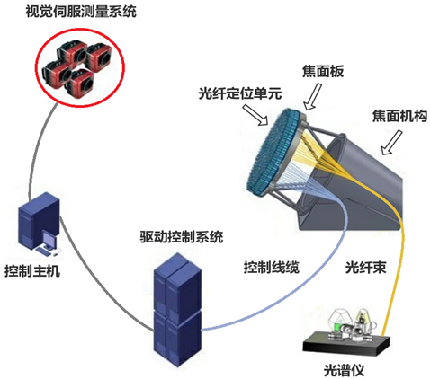

# 基于MVC模式的LAMOST光纤定位控制软件设计

我们实验室主要负责的就是==焦平面的光纤精确定位部分==。采用的方法是**并行可控式双回转光纤定位方案**，将焦面板划分为4000个相互重叠的圆形观测子区域，每个圆形观测子区域都与相邻的部分有重合部分，因此焦面板上的整个区域没有观测盲区。定位系统大致如下图所示：

现在即的lamost光纤定位控制软件使用的硬保护，单元头部装传感器，相邻单元接触头接触时立即停止相应单元的运行。并不能解决碰撞问题。文章中主要研究软件控制上规避单元间相互碰撞的算法：

- lamost光纤定位单元防碰撞分治标签算法
- 带Z轴离焦补偿的光纤定位单元浅度尝试算法

这两种算法都能解决光纤定位单元的碰撞问题。

然后利用Qt开发平台，将这两种类型的光纤定位单元进行防碰撞处理算法的实现，光纤定位单元防碰撞处理实现后作为一个模型，和其他模型一起放入进程中运行。通过进程间通信，调用防碰撞处理，解决相互碰撞问题。

### 防碰撞分值标签算法

首先划分**运行序列**，以==角度==来划分。当检测到两个光纤单元发生碰撞时，就进行**规避碰撞**（将光纤单元的中心轴或偏心轴运行序列在当前碰撞位置之前暂停p片运行数值为1的运行片），然后在运行序列末尾加上p片运行数值为1的运行片。）当光纤单元因为规避碰撞和整理运行序列造成运行序列的改变后，对其单元再次进行碰撞检测，直到无碰撞产生。当碰撞都处理完后再进行下一片的运行，直到所有光纤单元都到达其定位的目标位置。

### 带Z轴离焦补偿的光纤单元防碰撞浅度测试算法

这种方法设计了新的机构来定位光纤，新的机构的夹持机构可能会发生碰撞。

首先也是**划分运行序列**，碰撞发生时，在碰撞处理前**记录当前状态**，以便后续恢复。然后根据碰撞发生的不同情况使用不同的方法。使用该方法后，检测是否还会发生碰撞，若有就记录这种方法的使用次数。当记录次数大于6次就说明这个方法不能解决该问题，换另一个处理方法。这就是浅度尝试法。

而碰撞处理就是将当前光纤单元的中心轴或偏心轴运行序列**在当前的碰撞位置状态进行后退或前进运行**，以规避碰撞。