### 1.为什么要学习网络协议

通过网络协议，可以是机器间进行协作，完成更多的功能。

网络协议主要有5层：

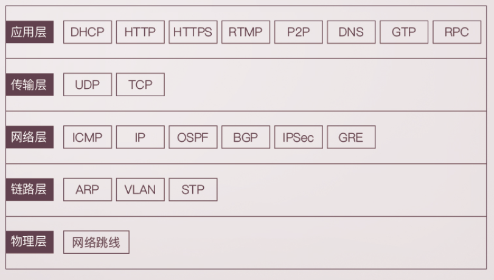

举例说明：打开浏览器，输入某购物网站的地址之后，浏览器会给你显示相应的页面，这是如何实现的呢？

它之所以会显示缤纷多彩的页面，是因为它收到了一段来自HTTP协议的“东西”，格式如下：

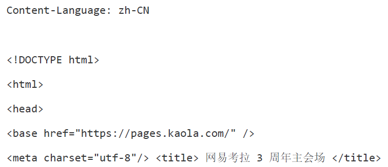

具体流程如下：

- 在浏览器输入例如www.baidu.com，这是一个URL，浏览器通过地址簿协议**DNS**或**HTTPDNS**查找。然后找到对应的IP地址，即互联网世界的“门牌号”。
- 知道了目标地址后，浏览器开始打包它的请求。对于普通的浏览请求，会使用HTTP协议；对于需要加密传输的，往往使用HTTPS协议。无论使用的哪个协议，都会写明具体内容：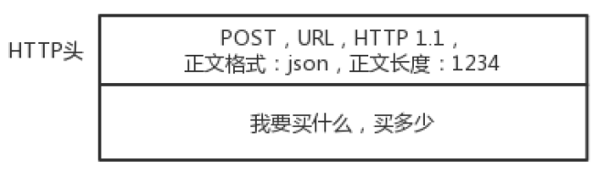
- DNS、HTTP、HTTPS所在的层称为**应用层**，经过应用层封装后，浏览器会将应用层的包交给下一层去完成，通过socket网络编程实现。下一层是传输层，**传输层有两种协议**，一种是无连接的UDP，一种是面向连接的协议TCP。比如支付这种场景，一般就使用TCP协议。面向连接的意思是，TCP会保证这个包能到达目的地，如果不能到达，就会重新发送，直到到达。
- TCP协议中有两个端口，一个是浏览器监听的端口，一个是服务器监听的端口，**操作系统**往往通过**端口**判断它得到的包应给哪个进程。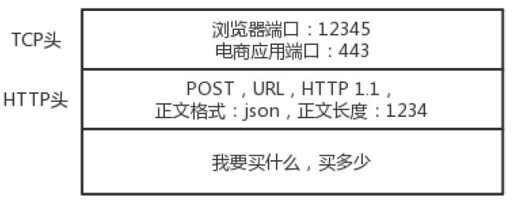
- 传输层封装完毕后，浏览器会将包交给操作系统的网络层，**网络层**的协议是**IP协议**，在IP协议中会有源IP地址，即浏览器所在机器的IP地址和目标IP地址。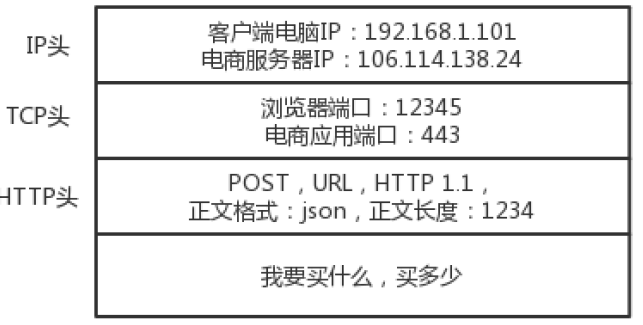
- 操作系统启动时，会被DHCP协议配置IP地址，而网关的IP地址通常是192.168.1.1。操作系统会在本地通信中通过ARP协议询问，网关回应MAC地址。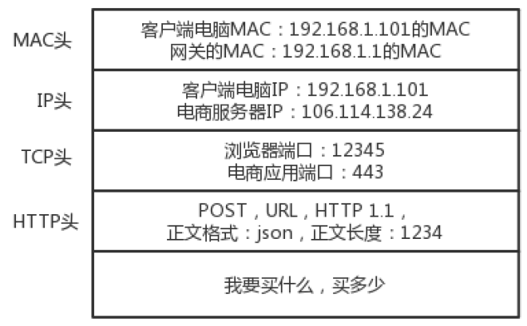
- 然后操作系统将IP包发给下一层，即MAC层。网卡将包发出去。由于这个包有MAC地址，因此它能够到达网关。
- 网关通常是一个路由器，收到包后悔根据路由表得到去目的IP的方法。
- 路由器连着许多个局域网，在每个局域网内部，都可以使用本地的地址MAC进行通信。
- 一旦跨越局域网，需要拿出IP头，表明源IP地址与目的IP地址。沟通的协议称为**路由协议**，常用的协议有OSPF和BGP。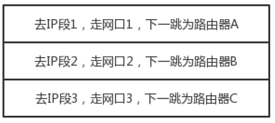
- 而路由器与路由器之间是一个局域网，当网络包直到要转发去哪个路由器之后，还是要使用该局域网内部的MAC地址，通过下一个路由器的MAC地址，找到下一个路由器。
- 最后一个路由器知道目标IP是哪，于是通过局域网内通信得到相应的目标服务器的MAC地址，通过这个MAC地址找到目标的服务器。
- 目标服务器发现MAC地址对上了，就取下MAC头给操作系统的网络层；IP对上了就取下IP头，IP头里会写上一层封装的是TCP协议，然后将其交给传输层。
- 在传输层，对于收到的每个包，都会有回复表示收到了。若过一段时间没发到，发送端的TCP层会重新发送这个包，直到收到目的端收到的回复。
- 当网络包平安到达TCP层之后，TCP头中有目标端口号，通过这个端口号，可以找到比如电商网站的进程正在监听这个端口号，因此就会将这个包发给该进程。

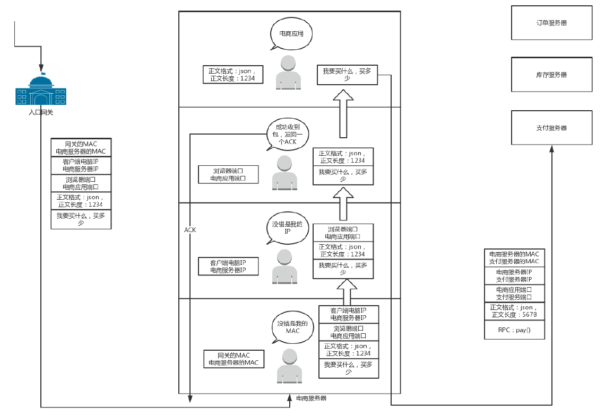

通常接受请求的进程是个接待员，它负责统筹处理这个请求，而不是完成所有的工作。这个进程会通过RPC调用（远程过程调用），告诉比如管理订单的进程，管理支付的进程等。接待员不用担心中间的网络互联问题，会由RPC框架统一处理。RPC框架有多种，比如基于HTTP协议放在HTTP报文里的，有直接封装在TCP报文中的。

当接待员发现相应的进程都处理完毕后，回复给浏览器一个HTTPS的包告知完成。这个包就会像来的时候一样，经过传递到达起初的浏览器。

### 2.网络分层的含义是什么？

网络为什么要分层？因为复杂的程序都要分层，这是程序设计的要求。

BIOS的作用：读取硬盘的MBR启动扇区，将GRUB启动起来；然后将权力交给GRUB，加载作为根文件系统的initramfs文件；然后将权力交给内核，最后内核启动，初始化整个系统。

### 3.DNS协议

#### 1、传统DNS存在的问题

##### 1）域名缓存问题

由于本地DNS服务器能做一个本地缓存，当有其他客户端询问DNS转IP的映射时，可能这个映射关系已经变更了，但本地缓存没有变，因此返回的是错误的结果。

##### 2）域名转发问题

比如A运营商的客户，访问自己运营商的DNS服务器，若A运营商去权威DNS服务器查询，返回一个部署在A运营商的网站地址，这样针对相同运营商的访问，就会快很多。

若A运营商偷懒，将解析的请求转发给B运营商，B运营商去权威DNS服务器查询的话，DNS服务器返回的是在B运营商的网站地址，结果客户端每次访问都要跨运营商，速度就很慢。

#### 2、HTTPDNS

为了解决上述的问题，有了HTTPDNS，它不走传统的DNS解析，而是自己搭建基于HTTP协议的DNS服务器集群，分布在多个地点和多个运营商。

一般是手机应用，手机上嵌入支持HTTPDNS的SDK。当客户端需要DNS解析时，直接通过HTTP协议进行请求这个服务器集群，得到就近的地址。相当于它不依赖默认的DNS路径，自行查找。

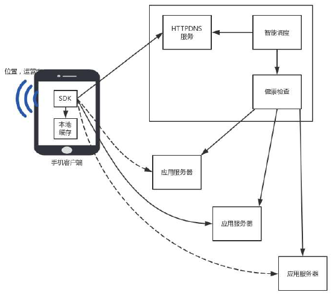

HTTPDNS主要解决的是**缓存设计**和**调度设计**问题。

##### 1、缓存设计

为了加快解析引入缓存，但是产生了缓存不及时更新导致访问错误的问题。传统的缓存在本地DNS服务器处，客户端难以解决。

而HTTPDNS在解析时使用HTTP请求，要实时更新时马上就能起作用。另一方面，本地维护缓存，放在客户端SDK处，过期时间、更新时间能自行控制。

##### 2、缓存设计模式

分为客户端、缓存、数据源三层。

1. 应用架构：即应用、缓存、数据库，常见的有Tomcat、Redis、MySQL
2. HTTPDNS：手机客户端、DNS缓存、HTTPDNS服务器

SDK的缓存会严格按照缓存过期时间，若缓存没命中或已经过期，会发起一次解析，保障记录是更新的。此时直接调用HTTPDNS的接口（同步更新，对应cache-aside机制，先读缓存，同时将结果写入缓存），返回最新的记录，更新缓存。

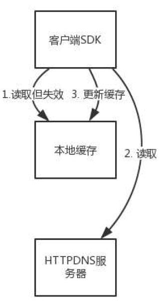

或者异步进行，添加一个解析任务到后台，由后台任务调用HTTPDNS的接口。对应refresh-ahead机制，业务应用仅仅访问缓存，当过期时定期刷新。

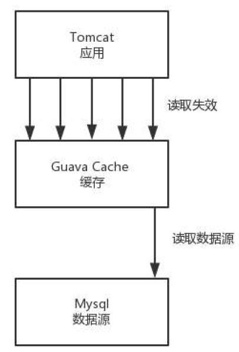

##### 3、调度设计

客户端嵌入SDK，可以知道该手机准确的位置、运营商等信息，HTTPDNS服务器可以根据这些信息选择最佳的服务器返回。

若多个节点，客户端的SDK会收集网络请求数据如错误率、请求时间等质量数据，并发送到统计后台，进行分析并查看不同IP的服务质量。

应用还能通过调用HTTPDNS的管理接口，配置不同服务质量的优先级、权重，HTTPDNS根据这些策略算出排序，优先访问优质的、低时延的IP地址。

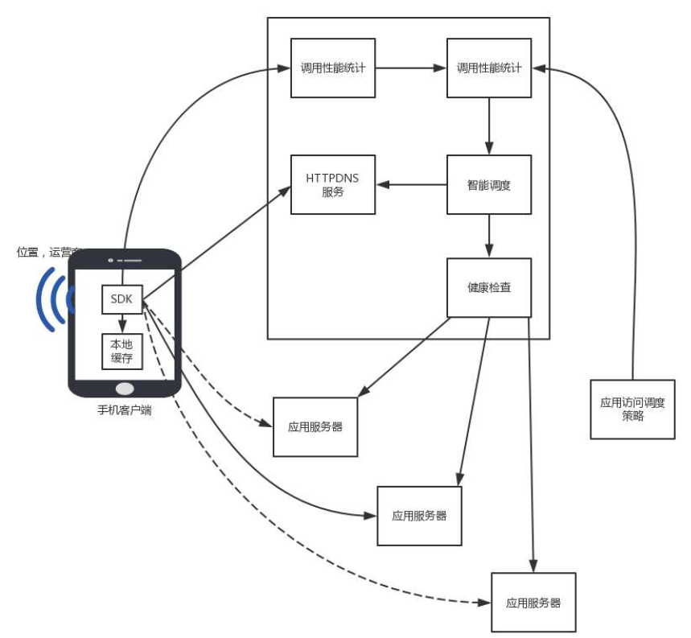