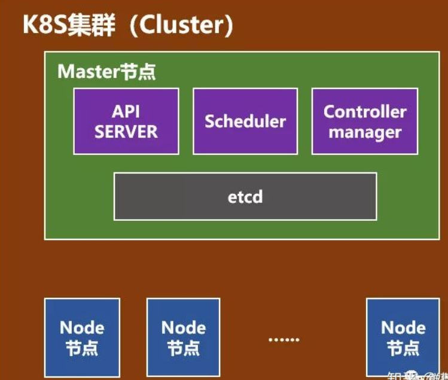
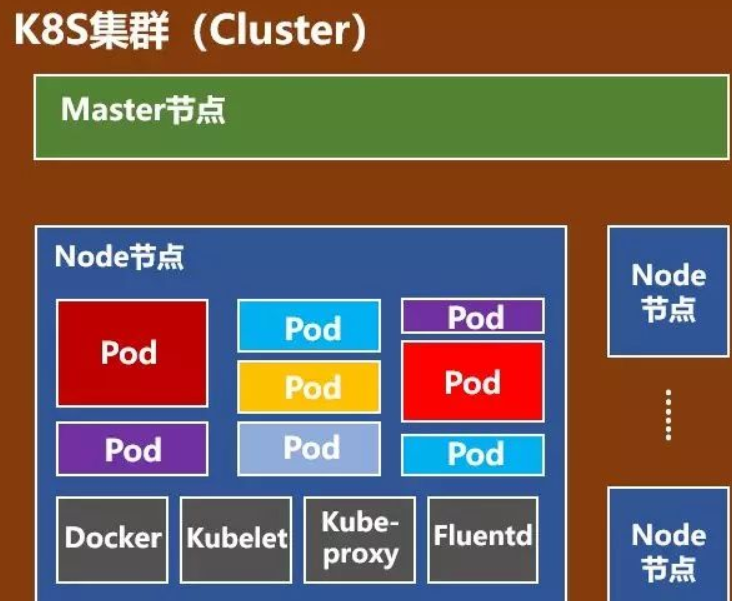

### k8s

参考链接：https://zhuanlan.zhihu.com/p/53260098

docker是轻量级的容器引擎，现已应用广泛，但企业想要对docker进行具体的编排、管理和调度时却发现存在困难。于是k8s应运而生。

k8s是基于容器的集群管理平台，一个k8s系统通常被称为k8s集群。这个集群主要包括：

1. 一个master节点（主节点）：主要负责管理和控制
2. 一群node节点（计算节点）：工作负载节点

#### master节点

- API server

整个系统对外的接口，供客户端和其他组件调用

- schedule

负责对集群内部的资源进行调度

- controller manager

负责管理控制器

#### node节点

- pod：基本的操作单元，一个pod代表一个进程，内部封装了一个或多个紧密联系的容器。
- kubelet：负责监视指派到它所在node上的pod，包括创建、修改、监控、删除等。
- kube-proxy：负责为pod对象提供代理
- fluentd：负责日志收集、存储和查询

