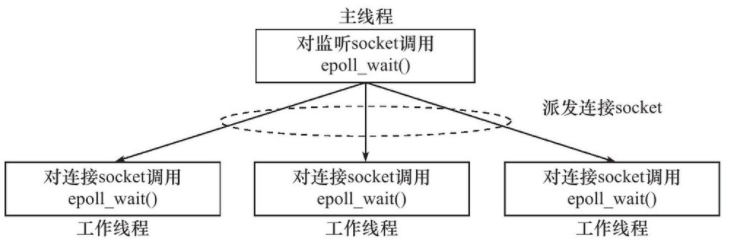

## 事件处理模式

### reactor模式

主线程只负责监听文件描述符上是否有事件发生，有就通知工作线程。读写数据、接受新的连接、处理客户请求都由工作线程完成。

#### 流程（使用同步I/O模型）如下

1. 主线程往epoll内核事件表注册socket上读就绪事件
2. 主线程调用epoll_wait等待
3. socket上有事件可读时，epoll_wait通知主线程，主线程将可读时间放入请求队列。
4. 请求队列上某个工作线程被唤醒，从socket上读取数据，并处理请求，然后在epoll内核事件表注册写就绪。
5. 主线程调用epoll_wait等待
6. socket可写时，epoll_wait通知主线程，主线程将可写事件插入请求队列
7. 请求队列上某个工作线程被唤醒，在socket上写入服务器处理请求的结果。

### Proactor模式

该模式将所有IO操作交给主线程和内核处理，工作线程只负责业务逻辑。这样更符合服务器编程框架。

#### 同步IO模拟proactor模式流程

1. 主线程往epoll内核事件表上注册socket读就绪事件
2. 主线程调用epoll_wait等待socket上有事件可读
3. socket上有事件可读时，epoll_wait通知主线程。主线程从socket上循环读取直到没有事件可读。将读取到的数据封装成请求对象插入到请求队列
4. 睡眠在请求队列上的工作线程被唤醒，获得请求对象并处理请求，然后在epoll内核事件表注册socket写就绪事件。
5. 主线程调用epoll_wait等待socket上有事件可写
6. 当socket可写时，epoll_wait通知主线程，主线程往socket上写入服务器处理的结果。

与这次写的服务器代码的流程一致。

## 并发模式

### 半同步/半异步模式

并发模式中的同步和异步表示程序是否完全按照代码顺序进行，异步指需要由**系统事件驱动**。IO中的同步异步表示内核向应用程序通知的是就绪事件还是完成事件。

按照异步方式运行的称为异步线程，显然异步线程执行效率更高。半同步/半异步模式中，同步线程处理客户逻辑，异步线程处理IO事件。

该模式的一种变体是**半同步/半反应堆模式**。流程如下：

1. 主线程充当异步线程，负责监听所有socket上的事件。
2. 主线程负责接收新的连接socket，并且负责注册到epoll事件表上
3. 有读写事件发生时，主线程将连接socket插入到请求对列上，睡眠在请求队列上的工作线程通过竞争获得任务的接管权。

这种模式下，工作线程和主线程都工作在异步模式，各自独立的监听不同的事件。

### 领导者追随者模式

多个工作线程轮流获得事件源集合，轮流监听、分发并处理事件的一种模式。任意时间点，程序都仅有一个领导者线程，它负责监听IO事件，其他线程都是追随者，休眠在线程池中等待成为新的领导者。

当前的领导者监测到IO事件后，首先在线程池中推举出新的领导者线程，然后处理IO事件。新的领导者继续等到新的IO事件的到来，此时原来的正在处理IO事件，实现了并发。

##  有限状态机

一个实例：HTTP请求的读取与分析。判断HTTP协议结束的标志是一个**仅包含回车换行符的空行(<CR><LF>)**，

对于HTTP请求的请求行、请求头、请求内容，分别使用不同的状态表示，最后根据返回的状态确定下一步处理。

## 池

对于HTTP请求，可以预先分配一个大小足够的接收缓冲区，当请求长度超过时可以再动态扩大。

创建进程池或者线程池。

连接池通常用于服务器机群内部的永久连接，比如某个逻辑单元需要频繁的访问本地的数据库，因此使用连接池，预先让服务器和数据库程序建立一组连接的集合，当某个逻辑单元需要访问数据库时，直接从连接池中取得一个连接的实体并使用。

## 上下文切换和加锁

IO密集型的服务器不宜使用过多的工作线程，否则线程间的切换会占用大量的CPU时间。因此多线程服务器中线程的数量不大于CPU的数量时，上下文的切换产生的影响就会较小。

加锁也会导致服务器效率低下，如果必须要使用锁，最好是读写锁，减小锁的粒度。当所有的工作线程只读取一块共享内存的内容时，读写锁不会再增加系统的额外开销。

