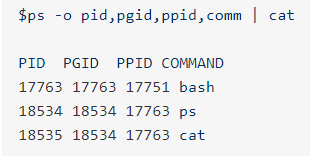
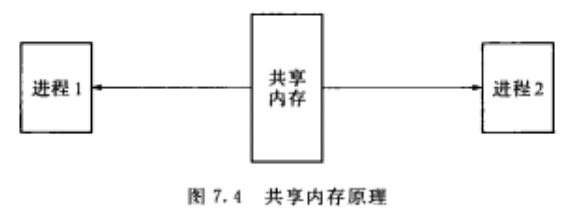

## 进程组

每个进程都有父进程，每个进程都以init进程为根，一起组成了树状结构。

每个进程都会属于一个进程组，每个进程组都能包含多个进程。进程组有一个领导进程(process group leader)，领导进程的pid是进程组的PGID。

能看出18534和18535属于一个进程组，它们的父进程都是17763。 

可以将信号发给一个进程组，进程组中的所有进程都会收到该信号。

## 会话

多个进程组能构成一个会话，会话是由其中的进程建立的，该进程是会话的领导进程（session leader），会话领导进程的pid称为识别会话的SID。会话中的每个进程组称为一个工作。

参考链接：

https://my.oschina.net/hosee/blog/507098

## 进程间通信

### 多进程：

使用fork创建新进程，子进程返回值为0，父进程返回值是子进程的进程id。参考链接：https://www.cnblogs.com/LUO77/p/5816326.html

### 管道

一种半双工的通信方式，数据只能单向流动，且只能在具有亲缘关系（父子进程）的进程间使用。

### 命名管道FIFO

半双工的通信方式，允许无亲缘关系进程间的通信。

### 消息队列

存放在内核中，是消息的链表。克服了信号传递信息少、管道只能承载无格式字节流以及缓冲区大小受限等缺点。

### 共享存储

映射一段能被其他进程所访问的内存，它是针对其他进程间通信方式运行效率低而专门设计的。一般与信号量配合使用，来实现进程间的同步和通信。

### 信号量

一个原子计数器，用来控制多个进程对共享资源的访问。作为一种锁机制，防止多个进程同时访问共享资源。主要作为同步手段。

### 套接字socket

可用于不同的进程通信。

### 信号

用于通知接收进程某个事件已经发生。信号可以在任何时刻发送给进程，且无需知道该进程的状态。当该进程未处于执行状态时，该信号由内核保存起来。直到该进程恢复执行并传递为止。若一个信号被进程设置为阻塞，则该信号的传递被延迟，直到其阻塞被取消为止。

程序中包含<signal.h>即可。

信号是软件层次上对于中断机制的一种模拟，一种**异步通信**方式，信号可以在用户空间进程和内核之间直接交互。信号事件有两个来源：

- 硬件来源，比如cltr+c，产生中断信号sigint
- 软件来源，比如使用系统调用或者命令发出信号，系统函数有kill、raise等

用户进程对信号产生的响应：

- 执行默认操作
- 捕捉信号，定义信号处理函数，当信号发生时，执行相应的处理函数
- 忽略信号，即不对信号进程作任何处理

但是SIGKILL和SEGSTOP无法捕捉和忽略，这是为了系统管理员能在任何时候中断或结束某一进程。

### 管道

管道允许进程间按先进先出的方式传递数据，具有以下特点：

- 半双工的，数据只能向一个方向流动；建立2管道可以双方通信
- 匿名管道只能用于父子进程或兄弟进程之间
- 单独构成一种独立的文件系统，管道对于管道两端的进程而言是一种文件。并且这个文件只存在于内存中。

管道主要分为pipe(无名管道)和命名管道FIFO两种。这两种的区别在于建立、打开、删除的方式不同。

- pipe用于相关进程间的通信，当最后一个使用它的进程关闭对它的引用时，pipe将自动撤销。
- FIFO即命名管道，在磁盘上有对应的节点，但没有数据块。建立之后，任何对该命名管道有适当访问权的进程都可以通过文件名将其打开和进行读写。当不再被进程使用时，FIFO在内存中是否，但磁盘节点依然存在。

管道的实质是内核缓冲区，进程以先进先出的方式从缓冲区存取数据。

### 消息队列

即消息的链表，是一系列**保存在内核中**消息的列表。用户进程可以向消息队列中添加消息，也可以向消息队列读取消息。

消息队列对每个消息指定特定的消息类型，接收时无需按队列次序。进程间通过消息队列通信，主要是创建或打开消息队列、添加消息、读取消息和控制消息队列。

### 共享内存

两个或多个进程共享一个给定的存储区，这一段存储区可被两个或多个进程映射至自身的地址空间。

对于管道和消息队列里的通信方式，需要内核和用户空间进行四次数据拷贝，共享内存只需拷贝2次。

进程间共享内存，不会在读写少量数据后就接触映射，而是保持共享区域直到通信完毕。共享内存中的内容往往是在解除映射时才写回文件。